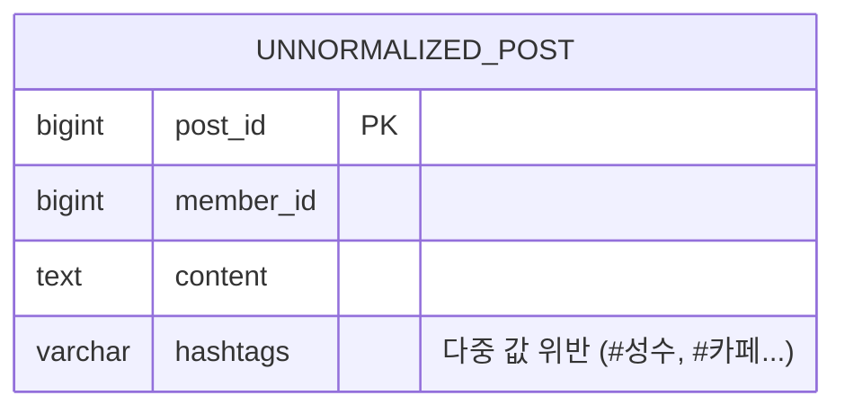
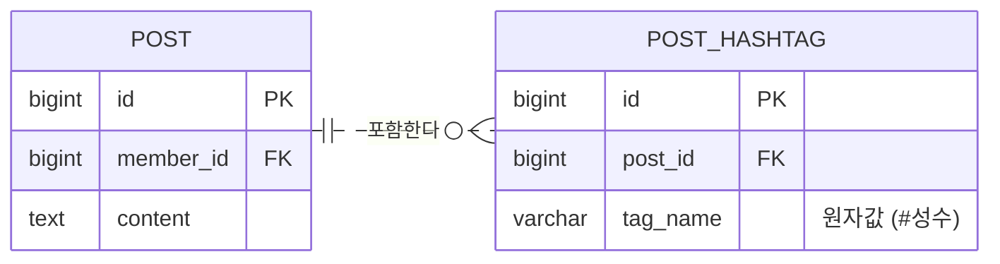
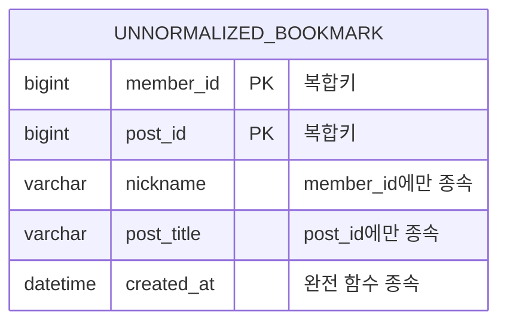
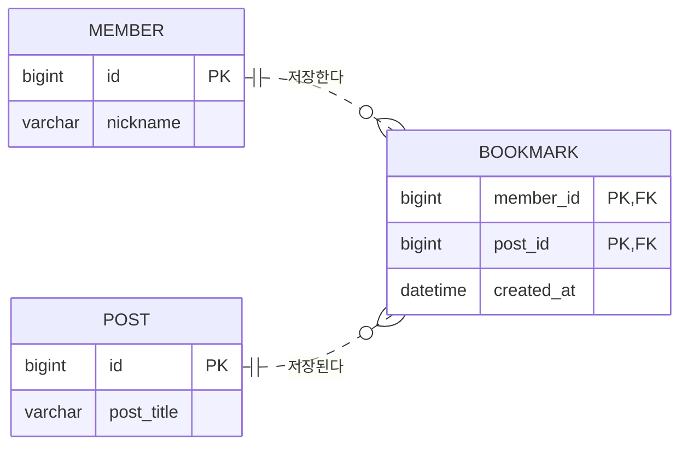
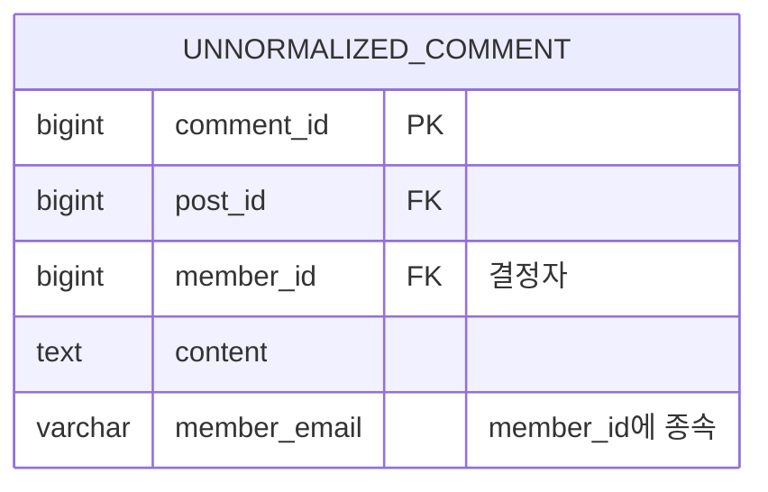
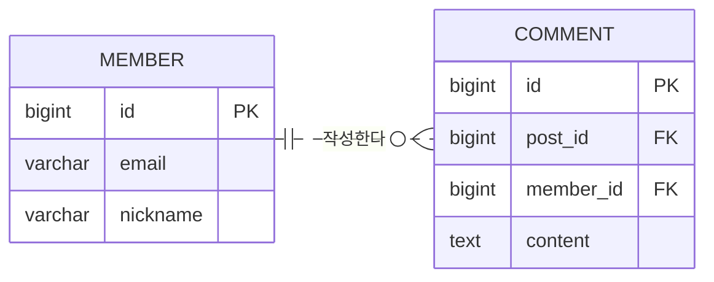
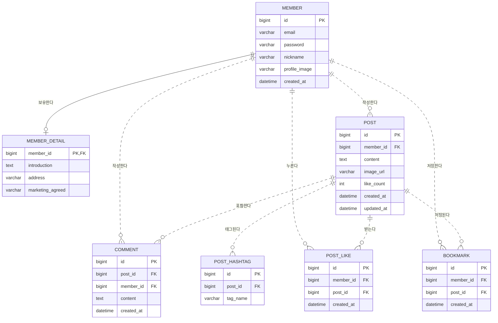

# 4. Spring 데이터 접근 기술과 데이터베이스 모델링

## 학습 목표
- JdbcTemplate을 활용하여 반복적인 JDBC 코드를 제거하고 효율적인 SQL 중심 개발 이해
- 데이터베이스 정규화 이론과 Crow's Foot 표기법 기반의 ERD 모델링 기법 습득
- 데이터베이스 인덱스의 B-Tree 동작 원리와 실행 계획(EXPLAIN) 분석 및 커서 기반 No-Offset 페이징 기법 습득
- 스프링 부트 환경에서 MyBatis 프레임워크를 활용한 SQL 매퍼 연동 및 동적 SQL 제어 기법 이해
- 단순 쿼리로 즉시 데이터베이스와 연동하는 Spring Data JDBC의 작동 메커니즘 파악

## 목차
- [1. 스프링 JDBC와 JdbcTemplate](#1-스프링-jdbc와-jdbctemplate)
  - [1.1 순수 JDBC와 복잡성](#11-순수-jdbc와-복잡성)
  - [1.2 JdbcTemplate 개요 및 의존성 설정](#12-jdbctemplate-개요-및-의존성-설정)
  - [1.3 RowMapper를 활용한 결과 매핑](#13-rowmapper를-활용한-결과-매핑)
  - [1.4 JdbcTemplate 기반 CRUD 구현](#14-jdbctemplate-기반-crud-구현)
  - [1.5 데이터베이스 접속 정보의 외부 격리 및 @Value 활용](#15-데이터베이스-접속-정보의-외부-격리-및-value-활용)
  - [1.6 데이터베이스 초기화 및 커넥션 풀 제어](#16-데이터베이스-초기화-및-커넥션-풀-제어)
- [2. 데이터베이스 모델링](#2-데이터베이스-모델링)
  - [2.1 데이터베이스 모델링 개요](#21-데이터베이스-모델링-개요)
  - [2.2 데이터베이스 정규화 이론](#22-데이터베이스-정규화-이론)
  - [2.3 ERD 설계와 Crow's Foot 표기법](#23-erd-설계와-crows-foot-표기법)
  - [2.4 식별 관계와 비식별 관계의 구조적 구분](#24-식별-관계와-비식별-관계의-구조적-구분)
  - [2.5 SNS 핵심 도메인 테이블 정의서 및 최종 DDL 스키마](#25-sns-핵심-도메인-테이블-정의서-및-최종-ddl-스키마)
  - [2.6 대표적인 모델링 도구 및 설계 가이드라인](#26-대표적인-모델링-도구-및-설계-가이드라인)
- [3. 인덱스와 쿼리 성능 최적화](#3-인덱스와-쿼리-성능-최적화)
  - [3.1 인덱스 정의와 옵티마이저 작동 원리](#31-인덱스-정의와-옵티마이저-작동-원리)
  - [3.2 인덱스 관리 SQL 및 설계 원칙](#32-인덱스-관리-sql-및-설계-원칙)
  - [3.3 쿼리 성능 저하 원인 분석](#33-쿼리-성능-저하-원인-분석)
  - [3.4 데이터베이스 실행 계획 확인](#34-데이터베이스-실행-계획-확인)
  - [3.5 페이징 처리 기법](#35-페이징-처리-기법)
- [4. MyBatis 연동](#4-mybatis-연동)
  - [4.1 MyBatis 아키텍처와 환경 설정](#41-mybatis-아키텍처와-환경-설정)
  - [4.2 Mapper 인터페이스와 XML 매퍼 연동](#42-mapper-인터페이스와-xml-매퍼-연동)
  - [4.3 게시판(board04) MyBatis 전환 단계별 실습](#43-게시판board04-mybatis-전환-단계별-실습)
  - [4.4 ResultMap과 매개변수 바인딩](#44-resultmap과-매개변수-바인딩)
  - [4.5 동적 SQL 제어](#45-동적-sql-제어)
- [5. 스프링 Data JDBC](#5-스프링-data-jdbc)
  - [5.1 Spring Data JDBC 개요 및 철학](#51-spring-data-jdbc-개요-및-철학)
  - [5.2 엔티티 설계와 테이블 매핑](#52-엔티티-설계와-테이블-매핑)
  - [5.3 CrudRepository 기본 CRUD 구현](#53-crudrepository-기본-crud-구현)
  - [5.4 쿼리 메서드와 @Query 어노테이션](#54-쿼리-메서드와-query-어노테이션)
  - [5.5 스프링 선언적 트랜잭션 연동](#55-스프링-선언적-트랜잭션-연동)
  - [5.6 데이터 접근 예외 처리 및 트러블슈팅](#56-데이터-접근-예외-처리-및-트러블슈팅)

---

# 1. 스프링 JDBC와 JdbcTemplate

## 1.1 순수 JDBC와 복잡성

### 1.1.1 보일러플레이트 코드의 한계
- 데이터베이스 연동 과정에서 발생하는 커넥션 연결, SQL 실행 객체 생성, 결과 집합(ResultSet) 처리 등 매번 반복되는 기반 코드가 다수 존재함.

```java
public List<PostDto> findAll() {
    String sql = "SELECT id, title, author, created_at AS createdAt FROM post";

    Connection conn = null;
    PreparedStatement pstmt = null;
    ResultSet rs = null;

    List<PostDto> result = new ArrayList<>();
    try{ // 플랜 A
        // 1. 데이터베이스 연결(Connection 객체 생성)
        conn = DriverManager.getConnection(DB_URL, DB_USER, DB_PASSWORD);

        // 2. SQL 실행 객체 생성(Statement 객체 생성)
        pstmt = conn.prepareStatement(sql);

        // 3. SQL 실행
        rs = pstmt.executeQuery();

        // 4. 결과 처리(ResultSet 사용)
        while(rs.next()){
            PostDto post = PostDto.builder()
                .id(rs.getInt("id"))
                .title(rs.getString("title"))
                .author(rs.getString("author"))
                .createdAt(rs.getObject("createdAt", LocalDateTime.class)).build();

            result.add(post);
        }

    }catch(Exception e){ // 플랜 B
        System.out.println("에러 발생: " + e.getMessage());
    }finally{
        // 5. 생성된 리소스를 생성의 역순으로 해제
        try{ if(rs != null) rs.close(); } catch (Exception e){ }
        try{ if(pstmt != null) pstmt.close(); } catch (Exception e){ }
        try{ if(conn != null) conn.close(); } catch (Exception e){ }
    }

    return result;
}
```

- 스프링 프레임워크는 이처럼 복잡하고 반복적인 데이터베이스 리소스 반납 및 예외 변환 작업을 템플릿 콜백 패턴 기반으로 대행하여 개발자가 순수 SQL 쿼리 작성과 데이터 바인딩에만 집중할 수 있도록 지원함.
  - 템플릿 콜백 패턴: 고정된 실행 흐름(템플릿) 속에서 변경해야 하는 가변적 로직을 콜백(인터페이스/람다) 형태로 전달받아 유연하게 처리하는 디자인 패턴. 스프링 `JdbcTemplate`의 경우 커넥션 획득, 스테이트먼트 실행, 리소스 반납 등 고정된 작업 흐름을 템플릿이 정의하고, 개발자가 작성한 구체적인 SQL 실행 및 RowMapper 매핑 로직만을 콜백 함수로 넘겨받아 동적으로 조합하여 수행함.

### 1.1.2 예외 처리의 강제성
- java.sql 패키지의 거의 모든 메서드가 체크 예외인 SQLException을 던짐.
- 기술 종속적인 예외 처리가 서비스 계층까지 전파되어 상위 계층의 순수성이 훼손됨.

#### 1) 서비스 계층의 기술 종속성 발생
- 리포지토리 계층에서 발생하는 SQLException을 처리하지 않고 던질 경우, 상위 비즈니스 로직을 처리하는 서비스 클래스의 메서드 시그니처와 임포트문에 `java.sql.SQLException`과 같은 특정 데이터베이스 접근 기술용 API가 직접 드러나 결합하게 됨.
  ```java
  package net.likelion.bebc25.board.service;
  
  import java.sql.SQLException; // 특정 데이터베이스 기술용 체크 예외에 종속됨
  
  @Service
  public class PostService {
      private final PostRepository postRepository;
  
      // 비즈니스 로직을 처리하는 계층임에도 불구하고 throws 선언이 강제됨
      public void registerPost(PostDto post) throws SQLException {
          postRepository.save(post);
      }
  }
  ```

#### 2) 순수성 훼손으로 인한 한계
- 서비스 계층은 핵심 비즈니스 규칙과 흐름 제어에만 집중해야 하는 영역이나, 기술 종속적인 예외가 노출됨으로써 계층 간의 완전한 격리가 실패함.
- 향후 데이터 접근 기술을 JPA나 NoSQL 등으로 교체할 경우 데이터베이스 기술 관련 예외 클래스가 변경되므로, 무관한 서비스 계층의 코드 영역까지 연쇄적으로 열어 수정해야 하는 유지보수 상의 문제를 유발함.

#### 3) 스프링의 예외 처리 방식
- 데이터베이스 처리 과정에서 발생하는 SQL 기반 체크 예외(`SQLException`)를 가로채어 스프링 프레임워크가 정의한 최상위 비체크 예외인 `DataAccessException` 계층 구조로 자동 변환하여 던짐.
- 특정 벤더 데이터베이스나 접근 기술(JDBC, JPA 등)에 상관없이 일관된 예외 추상화 계층을 제공함에 따라 서비스 영역의 임포트나 시그니처에서 `throws` 절이 효과적으로 제거되어 상위 서비스 계층의 기술 종속성 오염 문제를 근본적으로 해결함.

## 1.2 JdbcTemplate 개요 및 의존성 설정

### 1.2.1 JdbcTemplate 핵심 기능
- 커넥션의 획득 및 반납, 쿼리문 준비 및 실행, 예외 변환 등 저수준 JDBC API의 제어 흐름을 스프링 컨테이너가 대행함.
- 체크 예외인 SQLException을 스프링의 비체크 예외인 DataAccessException 계층 구조로 변환하여 예외 처리 편의성을 제공함.

### 1.2.2 의존성 설정 및 자동 구성
- build.gradle에 spring-boot-starter-jdbc 의존성을 추가하여 사용 가능함.
  ```groovy
  dependencies {
      implementation 'org.springframework.boot:spring-boot-starter-jdbc'
      runtimeOnly 'com.mysql:mysql-connector-j'
  }
  ```
- 스프링 부트는 application.properties 설정을 기반으로 DataSource와 JdbcTemplate 빈을 자동으로 생성 및 등록함.

## 1.3 RowMapper를 활용한 결과 매핑

- 데이터베이스 조회 결과인 `ResultSet`(표 형태의 데이터)의 각 행(Row)을 자바 객체(DTO 또는 Entity)로 어떻게 변환할지 규칙을 정의하는 매핑용 템플릿 인터페이스.
- `JdbcTemplate`은 데이터베이스 조회 결과를 받아올 때 내부적으로 반복문(while(rs.next()))을 돌면서, 개발자가 제공한 이 RowMapper 규칙을 매 행(Row)마다 호출시켜서 자바 객체 목록으로 조립해 반환함.

- RowMapper 인터페이스 구조
```java
@FunctionalInterface
public interface RowMapper<T> {
    // rs: 데이터베이스 조회 결과(ResultSet), rowNum: 현재 처리 중인 행의 번호(0부터 시작하는 인덱스)
    T mapRow(ResultSet rs, int rowNum) throws SQLException;
}
```

### 1.3.2 람다식 기반 매핑 예시
- RowMapper는 함수형 인터페이스이기 때문에 별도의 클래스를 만들거나 익명 클래스로 구현할 필요 없이 람다식으로 간결하게 매핑 로직을 작성할 수 있음
  ```java
  private final RowMapper<PostDto> postRowMapper = (ResultSet rs, int rowNum) -> {
      return new PostDto(
              rs.getInt("id"),
              rs.getString("title"),
              rs.getString("content"),
              rs.getString("author"),
              rs.getBoolean("secret"),
              rs.getObject("created_at", LocalDateTime.class)
      );
  };
  ```

## 1.4 JdbcTemplate 기반 CRUD 구현

### 1.4.1 데이터 등록, 수정, 삭제 (update)
- INSERT, UPDATE, DELETE 등 테이블 상태를 변경하는 작업에는 update 메서드를 사용하며, 반영된 행(Row) 수를 반환함.
  ```java
  public void save(PostDto post) {
      jdbcTemplate.update(
          "INSERT INTO post (title, content, author) VALUES (?, ?, ?)",
          post.getTitle(),
          post.getContent(),
          post.getAuthor()
      );
  }
  ```

### 1.4.2 단건 데이터 조회 (queryForObject)
- 기본 키 등을 통한 단건 조회 시 queryForObject 메서드를 활용하며, 조회 결과가 없거나 2건 이상인 경우 예외를 유발함.
  ```java
  public PostDto findById(int id) {
      return jdbcTemplate.queryForObject(
          "SELECT id, title, content, author, secret, created_at FROM post WHERE id = ?",
          postRowMapper,
          id
      );
  }
  ```

### 1.4.3 다건 데이터 조회 (query)
- 목록 조회 등 다건의 결과를 받아올 때 query 메서드를 활용하며, 결과가 없으면 빈 리스트를 반환함.
  ```java
  public List<PostDto> findAll() {
      return jdbcTemplate.query(
          "SELECT id, title, content, author, secret, created_at FROM post",
          postRowMapper
      );
  }
  ```

## 1.5 데이터베이스 접속 정보의 외부 격리 및 @Value 활용

### 1.5.1 외부 설정 파일 분리
- 데이터베이스 주소(URL), 사용자명, 패스워드 등 환경별로 달라지는 정보를 application.properties 파일에 키-값 쌍으로 정의함.(키는 자유롭게 정의 가능)
  ```properties
  db.url=jdbc:mysql://localhost:3306/board_db?serverTimezone=Asia/Seoul&characterEncoding=UTF-8&useSSL=false&allowPublicKeyRetrieval=true
  db.username=user1
  db.password=1111
  ```

### 1.5.2 @Value 어노테이션 기반 필드 주입
- 스프링 빈 클래스 내부의 필드에 @Value 어노테이션을 부착하여 설정 파일의 속성값을 직접 할당함.
  ```java
  @Component
  public class DbConfig {
      @Value("${db.url}")
      private String url;
      
      @Value("${db.username}")
      private String username;
  }
  ```

### 1.5.3 스프링 부트의 자동 구성 표준 데이터소스 설정
- 임의 변수명(예: `db.url`)에 값을 대입한 뒤 `@Value` 등으로 꺼내 수동 구성하는 방식과 달리, 스프링 부트가 규약해 둔 표준 키(Key) 이름으로 값을 기재하면 별도 Java 구현 코드 없이 자동으로 커넥션 풀(`DataSource`)을 자동 생성 및 빈으로 등록해 줌.
  ```properties
  # 드라이버 클래스 지정 (스프링 부트가 드라이버를 로드할 때 참고, 생략시 url 정보를 이용해서 자동으로 찾음)
  spring.datasource.driver-class-name=com.mysql.cj.jdbc.Driver

  # 데이터베이스 접속 주소
  spring.datasource.url=jdbc:mysql://localhost:3306/board_db?serverTimezone=Asia/Seoul&characterEncoding=UTF-8

  # 데이터베이스 접속 자격 증명 정보
  spring.datasource.username=user1
  spring.datasource.password=1234
  ```

## 1.6 데이터베이스 초기화 및 커넥션 풀 제어

### 1.6.1 초기화 스크립트 자동 실행
- 스프링 부트는 애플리케이션 시작 시점에 SQL 스크립트를 실행하여 데이터베이스 스키마와 기초 데이터를 자동으로 구축하는 기능을 지원함.
- 클래스패스 루트(src/main/resources) 아래에 schema.sql과 data.sql을 위치시키면, 스프링 부트가 구동되면서 테이블 생성 DDL과 초기 데이터 삽입 DML을 순차적으로 수행함.
- application.properties에 아래 설정을 적용하여 스크립트 실행 방식을 제어함.
  ```properties
  # SQL 스크립트 초기화 설정
  
  # always: 내장형/외장형 데이터베이스 여부와 상관없이 기동 시 무조건 초기화 스크립트(schema/data.sql) 실행
  spring.sql.init.mode=always

  # never: 초기화 스크립트 실행을 완전히 차단 (데이터 누적 및 보존을 위해 물리 DB 연동 시 필수 지정)
  # spring.sql.init.mode=never

  # embedded: 기본값으로 H2 등의 내장형 메모리 데이터베이스가 작동할 때만 초기화 스크립트 작동
  # spring.sql.init.mode=embedded
  ```

### 1.6.2 커넥션 풀과 HikariCP 관리
- 커넥션 풀은 데이터베이스와의 논리적 연결 통로(Connection)를 미리 생성하여 풀에 보관하고 재사용하는 기술로, 접속 시 발생하는 오버헤드를 낮추어 애플리케이션 반응 속도를 향상시킴.
- 스프링 부트는 고성능 JDBC 커넥션 풀 구현체인 HikariCP를 기본값으로 탑재하여 자동 설정함.
- 애플리케이션의 트래픽 규모에 맞게 application.properties에서 HikariCP 세부 설정을 최적화하여 관리함.
  ```properties
  spring.datasource.hikari.maximum-pool-size=10
  spring.datasource.hikari.minimum-idle=5
  spring.datasource.hikari.connection-timeout=30000
  spring.datasource.hikari.idle-timeout=600000
  ```

---

# 2. 데이터베이스 모델링

## 2.1 데이터베이스 모델링 개요

### 2.1.1 모델링 정의 및 3단계 설계 프로세스
- 데이터베이스 모델링은 현실 세계의 비즈니스 도메인 [^1] (SNS 서비스의 회원, 게시글, 댓글, 좋아요, 북마크 등)과 업무 흐름을 개념화하여 관계형 데이터베이스 테이블 구조로 변환하는 설계 과정.
- 설계 고도화 단계에 따라 3단계 절차를 거치며 구체화됨.

#### 1) 개념적 모델링 (Conceptual Modeling)
- 핵심 개체(Entity)를 식별하고 개체 간의 관계 및 카디널리티 [^2] (1:1, 1:N, N:M)를 개략적으로 정의하는 초기 구상 단계.
- 세부 데이터 타입이나 물리적 제약보다는 회원, 게시글, 댓글 등 비즈니스 핵심 도메인을 파악하는 데 중점을 둠.
- 모델링 결과
  - 핵심 개체 도출: 회원(Member), 게시글(Post), 댓글(Comment)
  - 관계 및 카디널리티 정의
    - 회원과 게시글: 1명의 회원은 여러 게시글 작성 가능 (1:N)
    - 게시글과 댓글: 1개의 게시글은 여러 댓글 포함 가능 (1:N)
    - 회원과 댓글: 1명의 회원은 여러 댓글 작성 가능 (1:N)
    - 회원과 게시글(좋아요/북마크): 회원은 여러 글에 반응하고 글은 여러 회원에게 반응을 받음 (N:M 다대다)

[개념적 모델링 대표 산출물: 개체 정의서]

| 개체명 (한글/영문) | 개체 정의 및 설명 | 비즈니스 식별자 후보 | 개체 분류 |
| :--- | :--- | :--- | :--- |
| 회원 (Member) | 서비스에 가입하여 활동하는 사용자 계정 | 이메일, 회원번호 | 기본 개체 |
| 게시글 (Post) | 회원이 피드에 작성한 콘텐츠 | 게시글번호 | 중심 개체 |
| 댓글 (Comment) | 특정 게시글에 회원이 작성한 피드백 | 댓글번호 | 행위 개체 |

- 개체 정의서 구성 속성
  - 개체명: 비즈니스 도메인에서 독립적으로 식별 및 관리해야 하는 대상 명칭(한글/영문).
  - 개체 정의 및 설명: 해당 개체가 시스템 내에서 수행하는 역할과 비즈니스 관리 목적 기술.
  - 비즈니스 식별자 후보: 업무 관점에서 각 개체 인스턴스를 유일하게 구별할 수 있는 자연 식별자 후보군.
  - 개체 분류
    - 기본/키 개체 (Fundamental/Key Entity): 다른 개체에 의존하지 않고 독립적으로 생성되는 고유 주식별자를 가진 개체 (예: 회원).
    - 중심 개체 (Main Entity): 기본 개체로부터 파생되어 업무의 중심 흐름을 담당하며 다수의 하위 행위 개체를 파생시키는 핵심 업무 개체 (예: 게시글).
    - 행위 개체 (Action Entity): 둘 이상의 상위 개체 간의 비즈니스 상호작용 및 사건에 의해 동적으로 생성되고 지속해서 누적되는 개체 (예: 댓글, 좋아요, 북마크).

[개체 분류 기준 및 특성 비교]

| 개체 분류 | 비즈니스 역할 | 부모 개체 관계 | 데이터 생성 및 종속성 | SNS 도메인 적용 예시 |
| :--- | :--- | :--- | :--- | :--- |
| 기본 개체 (Key Entity) | 독립적으로 존재하는 도메인의 기본 개체 | 독립 개체 (부모 없음) | 시스템 최초 생성, 회원/마스터 데이터 | 회원 (Member) |
| 중심 개체 (Main Entity) | 해당 도메인의 핵심 메인 업무 개체 | 1개 기본 개체에 종속 | 주 업무 개시 시 생성, 다수 행위 개체 파생 | 게시글 (Post) |
| 행위 개체 (Action Entity) | 업무 수행 중 발생하는 사건 및 상호작용 기록 | 2개 이상의 개체 결합 | 상호작용 발생 시 누적, 부모 삭제 시 연쇄 삭제 | 댓글 (Comment), 좋아요 (PostLike), 북마크 (Bookmark), 해시태그 (PostHashtag) |

#### 2) 논리적 모델링 (Logical Modeling)
- 식별된 개체들의 구체적인 속성(Attribute), 기본 키(PK), 외래 키(FK)를 정의하고, 데이터 중복과 이상 현상 방지를 위해 함수적 종속성 분석 및 정규화 [^3] (1NF, 2NF, 3NF 등)를 수행하는 단계.
- 특정 DBMS(MySQL, Oracle, PostgreSQL 등)에 종속되지 않는 표준 논리 스키마를 도출함.
- 모델링 결과
  - 회원(Member): #회원번호(PK), 이메일, 비밀번호, 닉네임, 프로필이미지, 가입일시
  - 회원상세(MemberDetail): #*회원번호(PK/FK), 자기소개, 주소, 마케팅수신동의 (1:1 수직 분할 개체 도출)
  - 게시글(Post): #게시글번호(PK), *작성자회원번호(FK), 본문, 이미지URL, 등록일시, 수정일시
  - 게시글해시태그(PostHashtag): #해시태그번호(PK), *게시글번호(FK), 태그명 (1NF 원자값 보장을 위한 1:N 개체 도출)
  - 댓글(Comment): #댓글번호(PK), *게시글번호(FK), *작성자회원번호(FK), 본문, 등록일시
  - 좋아요(PostLike): #좋아요번호(PK), *회원번호(FK), *게시글번호(FK), 등록일시 (N:M 해소를 위한 매핑 개체 도출)
  - 북마크(Bookmark): #북마크번호(PK), *회원번호(FK), *게시글번호(FK), 등록일시 (N:M 해소를 위한 매핑 개체 도출)

[논리적 모델링 대표 산출물: 개체 속성 명세서 (Post 개체 기준)]

| 속성명 (한글) | 속성명 (영문) | 식별자 구분 | 논리 도메인 | Null 허용 | 정규화 및 설명 |
| :--- | :--- | :--- | :--- | :--- | :--- |
| 게시글번호 | post_id | PK (주식별자) | 식별번호 | Mandatory (NN) | 단일 주식별자 |
| 작성자회원번호 | member_id | FK (외래식별자) | 식별번호 | Mandatory (NN) | 회원 개체 참조 |
| 본문내용 | content | 일반 속성 | 긴 텍스트 | Mandatory (NN) | 게시글 본문 내용 |
| 이미지URL | image_url | 일반 속성 | URL 문자열 | Optional (Null) | 첨부 이미지 경로 |
| 등록일시 | created_at | 일반 속성 | 일시 | Mandatory (NN) | 작성 시점 기록 |
| 수정일시 | updated_at | 일반 속성 | 일시 | Mandatory (NN) | 변경 시점 기록 |

- 개체 속성 명세서 구성 속성
  - 속성명 (한글/영문): 개체가 가지는 세부 성질이나 정보 항목의 표준 명칭.
  - 식별자 구분: 주식별자(PK), 외래식별자(FK), 일반 속성 여부를 명시.
  - 논리 도메인: 특정 DBMS 데이터 타입에 의존하지 않는 논리적 데이터 성격 분류(식별번호, 긴 텍스트, 날짜, 시간, 일시 등).
  - Null 허용 여부: 데이터 입력 시 필수 입력(Mandatory / Not Null) 또는 선택 입력(Optional / Nullable) 여부 지정.
  - 정규화 및 설명: 정규화 적용 결과, 유효 범위, 업무 규칙 등을 기술.

#### 3) 물리적 모델링 (Physical Modeling)
- 채택한 특정 DBMS 스펙에 맞춰 물리 테이블명, 컬럼명, 실제 데이터 타입(BIGINT, VARCHAR, DATETIME 등), 인덱스, 제약조건(UNIQUE, CASCADE 등)을 구체화하는 단계.
- 논리 모델링의 정규화된 스키마를 바탕으로 대용량 조회 성능과 디스크 I/O 최적화를 위해 반정규화(역정규화: 통계 컬럼 추가, 수직 분할 등)를 검토하고 최종 물리 스키마를 확정함.
- 모델링 결과 (MySQL 기준)
  - member: id BIGINT AUTO_INCREMENT PK, email VARCHAR(100) UNIQUE, password VARCHAR(255), nickname VARCHAR(50), profile_image VARCHAR(255), created_at DATETIME
  - member_detail: member_id BIGINT PK/FK, introduction TEXT, address VARCHAR(255), marketing_agreed VARCHAR(1), FOREIGN KEY (member_id) REFERENCES member(id) ON DELETE CASCADE
  - post: id BIGINT AUTO_INCREMENT PK, member_id BIGINT FK, content TEXT, image_url VARCHAR(255), like_count INT DEFAULT 0, created_at DATETIME, updated_at DATETIME
  - post_hashtag: id BIGINT AUTO_INCREMENT PK, post_id BIGINT FK, tag_name VARCHAR(50), FOREIGN KEY (post_id) REFERENCES post(id) ON DELETE CASCADE
  - comment: id BIGINT AUTO_INCREMENT PK, post_id BIGINT FK, member_id BIGINT FK, content TEXT, created_at DATETIME
  - post_like: id BIGINT AUTO_INCREMENT PK, member_id BIGINT FK, post_id BIGINT FK, created_at DATETIME, UNIQUE KEY(member_id, post_id), ON DELETE CASCADE
  - bookmark: id BIGINT AUTO_INCREMENT PK, member_id BIGINT FK, post_id BIGINT FK, created_at DATETIME, UNIQUE KEY(member_id, post_id), ON DELETE CASCADE

[물리적 모델링 대표 산출물: 테이블 정의서 (post 테이블)]

| 컬럼명 | 물리 데이터 타입 | Key | Nullable | Default | 제약조건 및 설명 |
| :--- | :--- | :--- | :--- | :--- | :--- |
| id | BIGINT | PK | NO | AUTO_INCREMENT | 기본 키 |
| member_id | BIGINT | FK | NO | None | FK -> member(id) ON DELETE CASCADE |
| content | TEXT | | NO | None | 게시글 본문 내용 |
| image_url | VARCHAR(255) | | YES | NULL | 업로드 이미지 URL |
| like_count | INT | | NO | 0 | 좋아요 집계 통계 컬럼 (반정규화) |
| created_at | DATETIME | | NO | CURRENT_TIMESTAMP | 등록 일시 |
| updated_at | DATETIME | | NO | CURRENT_TIMESTAMP | 최종 수정 일시 |

- 테이블 정의서 구성 속성 설명
  - 컬럼명: DBMS에 실제로 생성되는 물리적 컬럼 식별자.
  - 물리 데이터 타입: 채택한 DBMS의 물리적 저장 타입 및 할당 크기(BIGINT, VARCHAR(255), DATETIME 등).
  - Key 구분: 기본 키(PK), 외래 키(FK), 고유 키(UK) 여부.
  - Nullable: 물리적 NULL 허용 여부(NO: NOT NULL, YES: NULL 허용).
  - Default: 값이 명시되지 않았을 때 자동으로 입력되는 기본값(CURRENT_TIMESTAMP, AUTO_INCREMENT 등).
  - 제약조건 및 설명: 외래 키 참조 관계(ON DELETE CASCADE), 유니크 인덱스, 체크 제약조건 등 무결성 규칙 명세.

### 2.1.2 논리와 물리 데이터 모델 매핑

| 논리 모델 요소 | 물리 모델 요소 | SNS 도메인 적용 예시 |
| :--- | :--- | :--- |
| 개체 (Entity) | 테이블 (Table) | 회원(member), 게시글(post), 댓글(comment) |
| 속성 (Attribute) | 컬럼 (Column) | 이메일(email), 본문(content), 프로필 이미지(profile_image) |
| 주식별자 (Primary Identifier) | 기본 키 (Primary Key) | 회원 번호(id), 게시글 번호(id) |
| 관계 (Relationship) | 외래 키 (Foreign Key) | 게시글의 작성자(member_id), 댓글의 게시글 번호(post_id) |

## 2.2 데이터베이스 정규화 이론

### 2.2.1 정규화(Normalization) 정의 및 필요성
- 정규화(Normalization)는 데이터 중복을 최소화하고 데이터 조작 시 발생할 수 있는 이상 현상(Anomaly)을 예방하기 위해 무손실 분해를 수행하는 정제 과정.

[잘못 설계된 비정규 통합 테이블 예시 (회원-게시글 통합 테이블)]

| post_id (PK) | member_id | email | nickname | content | created_at |
| :--- | :--- | :--- | :--- | :--- | :--- |
| 1 | 101 | haru@test.com | haru | 첫 번째 게시글입니다. | 2026-08-01 10:00:00 |
| 2 | 101 | haru@test.com | haru | 두 번째 게시글입니다. | 2026-08-02 11:30:00 |
| 3 | 102 | namu@test.com | namu | 유일하게 작성한 게시글 | 2026-08-03 14:00:00 |

- 위와 같이 회원 정보와 게시글 정보가 하나의 테이블에 통합된 구조에서 발생하는 이상 현상 유형
  - 삽입 이상 (Insertion Anomaly)
    - 새로운 데이터를 추가하려 할 때 불필요하거나 아직 존재하지 않는 다른 속성의 값까지 억지로 입력해야 하는 현상.
    - 예시: 아직 작성한 게시글이 없는 신규 회원(member_id: 103, 닉네임: harong)을 등록하려 할 때, 기본키인 post_id 컬럼에 NULL을 입력할 수 없어 가짜 게시글 데이터를 억지로 입력해야만 회원 가입이 가능해지는 문제 발생.
  - 삭제 이상 (Deletion Anomaly)
    - 특정 레코드를 삭제할 때 의도하지 않은 유용한 연관 정보까지 함께 소멸되는 현상.
    - 예시: namu(member_id: 102) 회원이 작성한 유일한 게시글(post_id: 3)을 삭제하려 할 때, 해당 행(Row) 전체가 삭제되면서 namu 회원의 계정 정보(이메일, 닉네임)까지 함께 영구 소멸되는 문제 발생.
  - 갱신 이상 (Update Anomaly)
    - 중복 보관된 일부 데이터만 수정되어 데이터 간의 불일치와 정합성 모순이 발생하는 현상.
    - 예시: haru(member_id: 101) 회원이 닉네임을 변경할 때, 해당 회원이 작성한 1번과 2번 게시글 행의 닉네임을 모두 수정해야 하며, 일부 행만 수정되고 누락될 경우 글마다 닉네임이 다르게 표시되는 정합성 불일치 발생.

### 2.2.2 정규화 단계별 규칙

#### 1) 제1정규형 (1NF, First Normal Form: 원자값 보장)
- 테이블의 모든 컬럼이 더 이상 분해될 수 없는 단일 값(원자값)만을 가지도록 구성하는 규칙.
- 여러 개의 데이터(반복 그룹)를 하나의 컬럼에 쉼표(,)나 구분자로 묶어서 저장하는 비정규 구조를 제거.

[1NF 위반 예시: 잘못 설계된 비정규 게시글(post) 테이블 (다중 해시태그 저장)]

| post_id (PK) | member_id | content | hashtags (다중 값 위반) |
| :--- | :--- | :--- | :--- |
| 1 | 101 | 성수동 카페 투어 | #성수, #카페, #디저트 |
| 2 | 102 | 주말 러닝 기록 | #러닝, #운동 |

- 문제점
  - 데이터 원자성 위반: 하나의 컬럼(`hashtags`)에 여러 개의 태그 데이터가 쉼표(,)로 묶여 저장되어 있어 컬럼 값이 단일 원자값을 유지하지 못함.
  - 검색 비효율 발생: 특정 해시태그(예: `#카페`)를 검색할 때 텍스트 일부분을 비교하는 복잡한 문자열 포함 조건(`LIKE '%#카페%'`)을 사용해야 하므로, 데이터양이 많아질수록 데이터베이스가 모든 행을 일일이 대조해야 하여 검색 속도가 크게 저하됨.
  - 데이터 조작 한계: 특정 태그만 선택하여 수정하거나 삭제할 때 복잡한 문자열 분리 및 치환 처리가 필요하여 애플리케이션 연산 부하와 정합성 왜곡 위험이 증가함.

[1NF 적용 후 개선: 해시태그 연관 개체(post_hashtag) 테이블 분리]

| id (PK) | post_id (FK) | tag_name (원자값) |
| :--- | :--- | :--- |
| 1 | 1 | #성수 |
| 2 | 1 | #카페 |
| 3 | 1 | #디저트 |
| 4 | 2 | #러닝 |
| 5 | 2 | #운동 |

<div align="center">

[1NF 적용 전]

</div>



<div align="center">

[1NF 적용 후]

</div>



#### 2) 제2정규형 (2NF, Second Normal Form: 부분 함수 종속성 제거)
- 제1정규형을 만족하면서, 기본 키가 2개 이상의 컬럼으로 구성된 복합 키 [^4] (Composite Key)일 때, 일반 컬럼이 복합 기본 키 전체에 완전 함수 종속되어야 하며 기본 키의 일부 컬럼에만 종속(부분 함수 종속)되지 않도록 분리하는 규칙.

- 함수 종속(Functional Dependency) 유형 구분
  - 함수 종속: 특정 컬럼 X의 값을 알면 컬럼 Y의 값이 오직 하나로 결정되는 관계(X -> Y).
  - 완전 함수 종속 (복합키 전체 종속): 복합 기본키를 구성하는 모든 컬럼의 값을 합쳐서 알아야만 일반 속성의 값이 유일하게 결정되는 관계 (예: `(member_id, post_id) -> created_at`).
  - 부분 함수 종속: 복합 기본키 전체가 아닌 일부 키 컬럼만으로도 일반 속성의 값이 결정되는 관계 (예: `member_id -> nickname`, `post_id -> post_title`).

[2NF 위반 예시: 잘못 설계된 비정규 북마크(bookmark) 테이블 (부분 함수 종속)]

| member_id (PK) | post_id (PK) | nickname (member_id에 종속) | post_title (post_id에 종속) | created_at (복합키 전체 종속) |
| :--- | :--- | :--- | :--- | :--- |
| 101 | 1 | haru | 첫 번째 게시글 | 2026-08-01 10:00:00 |
| 101 | 2 | haru | 두 번째 게시글 | 2026-08-02 11:30:00 |

- 종속성 분석 및 문제점
  - `created_at`: "101번 회원이 1번 글을 북마크한 시각"처럼 member_id와 post_id 둘 다 알아야 결정되므로 완전 함수 종속.
  - `nickname`, `post_title`: 누가 북마크했는지만 알면 닉네임이 결정되고, 몇 번 글인지만 알면 제목이 결정되므로 키의 일부에만 종속되는 부분 함수 종속 발생. 회원이 북마크를 1,000개 등록하면 동일한 닉네임이 1,000번 중복 저장되는 데이터 낭비 및 갱신 이상 유발.

[2NF 적용 후 개선 (부분 종속 속성을 각 본래 개체 테이블로 분리)]
- 회원 개체 (member): member_id (PK), nickname
- 게시글 개체 (post): post_id (PK), post_title
- 북마크 개체 (bookmark): member_id (PK), post_id (PK), created_at (복합키 전체에 완전 종속되는 속성만 보관)

<div align="center">

[2NF 적용 전]

</div>



<div align="center">

[2NF 적용 후]

</div>



#### 3) 제3정규형 (3NF, Third Normal Form: 이행적 함수 종속성 제거)
- 제2정규형을 만족하면서, 테이블의 모든 일반 컬럼이 오직 기본 키(PK)에 의해서만 직접 결정되도록 구성하는 규칙.
- 기본 키가 아닌 일반 컬럼이 또 다른 일반 컬럼을 결정하여 발생하는 이행 [^5] 함수 종속(X -> Y -> Z 관계에서 Y -> Z)을 제거하여 별도의 개체 테이블로 분리함.

[3NF 위반 예시: 잘못 설계된 비정규 댓글(comment) 테이블 (이행 함수 종속)]

| comment_id (PK) | post_id (FK) | member_id (FK) | content | member_email (member_id에 종속) |
| :--- | :--- | :--- | :--- | :--- |
| 1 | 1 | 101 | 좋은 글 감사합니다. | haru@test.com |
| 2 | 1 | 101 | 추가 질문 있습니다. | haru@test.com |

- 종속성 분석 및 문제점
  - 종속 관계 흐름: 기본 키인 `comment_id`가 작성자 `member_id`를 결정하고(`comment_id -> member_id`), 일반 컬럼인 `member_id`가 또 다른 일반 컬럼인 `member_email`을 결정함(`member_id -> member_email`). 결과적으로 기본 키를 거쳐 이메일이 간접 종속되는 이행 함수 종속(`comment_id -> member_id -> member_email`)이 발생하므로, 일반 컬럼 간 종속 관계(`member_id -> member_email`)를 분리하여 회원 개체로 이관해야 함.
  - 문제점: haru(101) 회원이 이메일을 변경할 때, 해당 회원이 작성한 수백 개의 댓글 행에 저장된 이메일을 모두 찾아 수정해야 하는 갱신 이상이 발생함. 댓글 개체는 댓글 본문(`content`)과 작성자 식별자(`member_id`)만 보관하고 이메일은 회원 개체를 참조하도록 구성해야 함.

[3NF 적용 후 개선 (이행 종속 속성 분리 및 회원 개체 외래 키 참조)]
- 회원 개체 (member): id (PK), email, nickname
- 댓글 개체 (comment): id (PK), post_id (FK), member_id (FK), content (작성자 식별자 member_id 외래 키만 유지하고 이메일은 회원 개체를 참조)

<div align="center">

[3NF 적용 전]

</div>



<div align="center">

[3NF 적용 후]

</div>



### 2.2.3 반정규화 (De-normalization)
- 읽기 조회 성능 향상과 쿼리 단순화를 위해 의도적으로 데이터 중복을 허용하거나 계산·통계 값을 컬럼으로 보관하는 물리적 설계 기법.
- 정규화를 엄격히 적용할수록 데이터 무결성은 높아지지만, 화면 조회를 위해 많은 조인(JOIN)이나 실시간 집계(COUNT) 연산이 필요하여 읽기 성능이 저하될 수 있음.

#### 1) 대표 유형 1: 통계·집계 컬럼 추가 (중복 컬럼 반정규화)

[반정규화 적용 전 예시: 순수 3정규화 상태 (게시글 및 좋아요 테이블 분리)]

- 게시글 테이블 (`post`)

| id (PK) | member_id | content | created_at |
| :--- | :--- | :--- | :--- |
| 1 | 101 | 성수동 카페 투어 | 2026-08-01 10:00:00 |
| 2 | 102 | 주말 러닝 기록 | 2026-08-02 11:30:00 |

- 좋아요 테이블 (`post_like`)

| id (PK) | member_id (FK) | post_id (FK) | created_at |
| :--- | :--- | :--- | :--- |
| 1 | 101 | 1 | 2026-08-01 10:05:00 |
| 2 | 102 | 1 | 2026-08-01 10:10:00 |
| 3 | 103 | 1 | 2026-08-01 11:00:00 |

- 순수 정규화 상태의 조회 분석 및 성능 한계
  - 실시간 집계 연산 부하: SNS 메인 피드에서 게시글 목록과 각 글의 '좋아요 개수'를 표시하려면 게시글과 좋아요 테이블을 조인하고 그룹화하여 `COUNT()`를 매번 실행해야 함.

  ```sql
  -- 순수 정규화 상태에서 게시글 목록과 좋아요 수를 함께 조회하는 쿼리
  SELECT 
      p.id, 
      p.content, 
      p.created_at, 
      COUNT(pl.id) AS like_count
  FROM post p
  LEFT JOIN post_like pl ON p.id = pl.post_id
  GROUP BY p.id, p.content, p.created_at
  ORDER BY p.id DESC;
  ```

  [순수 정규화 JOIN 집계 쿼리 실행 결과]

  | id | content | created_at | like_count |
  | :--- | :--- | :--- | :--- |
  | 2 | 주말 러닝 기록 | 2026-08-02 11:30:00 | 0 |
  | 1 | 성수동 카페 투어 | 2026-08-01 10:00:00 | 3 |

  - 대용량 데이터 조회 지연: 좋아요 데이터가 수백만 건 이상 누적되면 단순 피드 목록 조회 화면을 렌더링하는 데도 과도한 데이터베이스 연산 비용과 응답 지연이 유발됨.

[반정규화 적용 후 개선: 통계 집계 컬럼(like_count)을 추가한 게시글 테이블]

| id (PK) | member_id | content | like_count (반정규화 컬럼) | created_at |
| :--- | :--- | :--- | :--- | :--- |
| 1 | 101 | 성수동 카페 투어 | 3 | 2026-08-01 10:00:00 |
| 2 | 102 | 주말 러닝 기록 | 0 | 2026-08-02 11:30:00 |

```sql
-- 반정규화(like_count 컬럼 추가) 후 단순 조회 쿼리
SELECT id, content, like_count, created_at
FROM post
ORDER BY id DESC;
```

- 통계 컬럼 반정규화 도입의 장단점 및 관리 주의점
  - 조회 성능 최적화: `post` 테이블 단건 조회만으로 좋아요 수를 즉시 가져올 수 있어 `COUNT(*)` 집계 연산과 조인 비용이 완전히 제거됨.
  - 쓰기 부하 및 데이터 정합성 관리 비용: 사용자가 좋아요를 누르거나 취소할 때마다 `post_like` 테이블 INSERT/DELETE 외에도 `post.like_count` 컬럼 값을 +1/-1로 업데이트해야 하므로 쓰기(Write) 연산 부하가 증가함.
  - 데이터 불일치 위험: 두 작업 중 하나가 실패하면 실제 좋아요 행 수와 `like_count` 숫자가 어긋나는 정합성 왜곡이 발생하므로 반드시 비즈니스 로직에서 트랜잭션으로 묶어 원자성을 보장해야 함.

#### 2) 대표 유형 2: 테이블 수직 분할 (Vertical Partitioning)
- 제3정규형을 충족하여 모든 컬럼이 기본키에 직접 종속되어 있더라도, 컬럼 수가 너무 많거나 대용량 텍스트/드물게 조회되는 컬럼이 함께 포함되어 있을 때 디스크 I/O 최적화를 위해 테이블을 1:1 관계로 분리하는 기법.

[수직 분할 전: 자주 쓰는 컬럼과 드물게 쓰는 컬럼이 결합된 통합 테이블 (`member`)]

| id (PK) | email | nickname | profile_image | introduction (자기소개 TEXT) | address | marketing_agreed | created_at |
| :--- | :--- | :--- | :--- | :--- | :--- | :--- | :--- |
| 101 | haru@test.com | haru | /img/haru.png | 안녕하세요. 일상 기록용 계정입니다. | 서울시 성동구 성수동 | Y | 2026-08-01 09:00:00 |

- 수직 분할 전 문제점
  - 행(Row) 크기 비대화: 대용량 텍스트나 부가 컬럼 때문에 행 크기가 커져 데이터베이스의 디스크 1페이지(기본 16KB)에 담을 수 있는 레코드 수가 감소함.
  - 디스크 I/O 낭비: 로그인이나 피드 작성자 표시처럼 `id`, `nickname`, `profile_image`만 필요한 단순 조회 시에도 무거운 컬럼들을 매번 디스크와 메모리에 함께 적재해야 하므로 캐시 효율이 저하됨.

[수직 분할 후 개선: 핵심 기본 테이블과 상세 정보 테이블로 1:1 분리]

- 핵심 회원 테이블 (`member`: 자주 조회되는 핵심 컬럼만 유지)

| id (PK) | email | nickname | profile_image | created_at |
| :--- | :--- | :--- | :--- | :--- |
| 101 | haru@test.com | haru | /img/haru.png | 2026-08-01 09:00:00 |

- 회원 상세 테이블 (`member_detail`: 내 정보 수정 등 가끔 조회되는 컬럼 분리)

| member_id (PK/FK) | introduction | address | marketing_agreed |
| :--- | :--- | :--- | :--- |
| 101 | 안녕하세요. 일상 기록용 계정입니다. | 서울시 성동구 성수동 | Y |

- 수직 분할 도입의 장단점 및 관리 주의점
  - 조회 성능 최적화: 핵심 테이블(`member`)의 행 크기가 축소되어 디스크 1페이지당 적재 행 수가 증가하고 메모리 캐시 적재 효율과 목록 조회 처리량이 향상됨.
  - 조인 비용 발생: 회원 기본 정보와 상세 정보(`member_detail`)가 동시에 필요한 마이페이지 등의 화면에서는 1:1 조인(JOIN) 쿼리가 강제되는 오버헤드가 발생함.
  - 관리 복잡도 증가: 회원 가입이나 회원 탈퇴 시 두 개 테이블에 걸쳐 INSERT/DELETE 작업을 수행해야 하므로 비즈니스 로직 및 트랜잭션 관리가 복잡해짐.

## 2.3 ERD 설계와 Crow's Foot 표기법

### 2.3.1 ERD(Entity Relationship Diagram)와 카디널리티 기호
- ERD 는 테이블 구조와 테이블 간의 연관 관계를 시각적으로 표현한 설계 모델 도면.
- Crow's Foot(새발) 표기법 카디널리티 규격
  - 필수 1 (Mandatory One, ||)
    - 상대 개체에 대응하는 데이터가 반드시 정확히 1건 존재해야 하는 관계 (1..1).
    - 예시: 하나의 게시글(post) 또는 댓글(comment)은 반드시 등록된 단 1명의 회원(member)에 의해서만 작성되어야 함 (`MEMBER ||..o{ POST` 관계에서 MEMBER 측 `||` 기호).
  - 선택 1 (Optional One, o|)
    - 상대 개체에 대응하는 데이터가 존재하지 않거나(0) 존재하더라도 최대 1건만 존재하는 관계 (0..1).
    - 예시: 회원(member)과 회원 상세 정보(member_detail)의 관계에서, 가입 초기에는 상세 프로필 데이터가 없을 수 있고(0), 등록하더라도 회원 1명당 최대 1개의 상세 정보만 가짐 (`MEMBER ||--o| MEMBER_DETAIL` 관계에서 MEMBER_DETAIL 측 `o|` 기호).
  - 필수 다수 (Mandatory Many, |{ 또는 |<)
    - 상대 개체에 대응하는 데이터가 최소 1건 이상 반드시 다수 존재해야 하는 관계 (1..N).
    - 예시: 하나의 전자상거래 주문(orders)은 최소 1개 이상의 주문 상품 항목(order_item)이 존재해야 결제가 성립함 (`ORDERS ||..|{ ORDER_ITEM` 관계에서 ORDER_ITEM 측 `|{` 기호).
  - 선택 다수 (Optional Many, o{ 또는 o<)
    - 상대 개체에 대응하는 데이터가 전혀 없을 수도 있고(0), 여러 개 존재할 수도 있는 관계 (0..N).
    - 예시: 회원(member)과 게시글(post)의 관계에서 신규 회원은 아직 작성한 글이 0건일 수 있고, 활동에 따라 수십~수백 건의 글을 작성할 수 있음 (`MEMBER ||..o{ POST` 관계에서 POST 측 `o{` 기호). 게시글과 댓글/좋아요/북마크의 관계도 동일함.

- 도메인 관계선 작성 예시
  ```
  MEMBER ||--o| MEMBER_DETAIL : "보유한다"
  MEMBER ||..o{ POST : "작성한다"
  MEMBER ||..o{ COMMENT : "작성한다"
  POST ||..o{ COMMENT : "포함한다"
  POST ||..o{ POST_HASHTAG : "태그된다"
  MEMBER ||..o{ POST_LIKE : "누른다"
  POST ||..o{ POST_LIKE : "받는다"
  MEMBER ||..o{ BOOKMARK : "저장한다"
  POST ||..o{ BOOKMARK : "저장된다"
  ```
  - 회원(MEMBER)과 회원 상세(MEMBER_DETAIL): 한 명의 회원은 상세 정보가 없거나 최대 1개 보유할 수 있으며(0..1), 하나의 상세 정보는 반드시 1명의 회원에 귀속됨(1..1).
  - 회원(MEMBER)과 게시글(POST): 한 명의 회원은 게시글을 작성하지 않거나 여러 개 작성할 수 있으며(0..N), 하나의 게시글은 반드시 1명의 회원에 의해 작성됨(1..1).
  - 게시글(POST)과 해시태그(POST_HASHTAG): 하나의 게시글에는 해시태그가 없거나 여러 개 등록될 수 있으며(0..N), 하나의 해시태그 레코드는 반드시 1개의 게시글에 소속됨(1..1).
  - 게시글(POST)과 댓글(COMMENT): 하나의 게시글에는 댓글이 없거나 여러 개 달릴 수 있으며(0..N), 하나의 댓글은 반드시 1개의 게시글에 소속됨(1..1).
  - 회원-게시글 간 좋아요(POST_LIKE) 및 북마크(BOOKMARK): 회원과 게시글 간의 N:M 다대다 관계를 중간 매핑 테이블로 해소하여, 한 회원이 여러 글에 좋아요/북마크를 누르고 한 게시글이 여러 회원에게 좋아요/북마크를 받을 수 있도록 1:N 관계 2개로 분할 설계함.

### 2.3.2 SNS 핵심 도메인 ERD 다이어그램



## 2.4 식별 관계와 비식별 관계의 구조적 구분
- 자식 테이블이나 N:M 매핑 테이블(좋아요, 북마크 등)을 설계할 때 "부모 테이블의 외래 키(FK)를 자식의 기본 키(PK)로 결합하여 사용할 것인가, 아니면 자식 고유의 단독 대리키(id)를 별도로 둘 것인가"를 결정하는 설계 기준.
- 자바 엔티티 설계 복잡도와 스프링 데이터 리포지토리 매핑 난이도, 테이블 스키마 확장성에 직접적인 영향을 미침.

### 2.4.1 N:M(다대다) 관계의 한계와 중간 매핑 테이블 (Junction Table)
- RDBMS의 구조적 한계
  - 관계형 데이터베이스의 테이블 컬럼은 오직 하나의 단일 값(원자값)만 저장할 수 있으므로, 다대다(N:M) 관계를 맺는 두 테이블 간에는 외래 키(FK)를 직접 연결할 수 없음.
  - 예: 회원(Member) 테이블에 좋아요 누른 수많은 게시글 번호를 쉼표로 저장할 수 없고, 게시글(Post) 테이블에도 좋아요를 누른 수많은 회원 번호를 직접 나열할 수 없음.
- 중간 매핑 테이블을 통한 관계 해소 원리
  - 두 테이블 사이에 행위 개체 역할을 하는 중간 매핑 테이블(Junction / Bridge Table: `post_like`, `bookmark`)을 추가함.
  - 부모 테이블들과 중간 매핑 테이블 간의 관계를 1:N 관계 2개로 분할하여 연결함으로써 RDBMS의 물리적 한계를 해소함.

  ```
  MEMBER ||..o{ POST_LIKE : "누른다 (1:N)"
  POST   ||..o{ POST_LIKE : "받는다 (1:N)"
  ```

- 중간 매핑 테이블의 기본 키(PK) 설계 선택
  - 신설된 중간 매핑 테이블을 설계할 때, 부모의 외래 키들을 묶어 PK로 사용할지(식별 관계), 독립적인 단독 id를 PK로 부여할지(비식별 관계)를 선택해야 함.

### 2.4.2 식별 관계 (Identifying Relationship)
- 부모 테이블의 기본 키(PK)가 자식 테이블의 기본 키(PK)의 일부(복합 키)로 구성되는 종속 구조.
- 자식 데이터의 고유 식별자가 부모 키를 포함하므로 부모 없이 독립적으로 존재할 수 없음.
- ERD 다이어그램에서 실선(Solid Line)으로 표시함.

### 2.4.3 비식별 관계 (Non-Identifying Relationship)
- 부모 테이블의 기본 키(PK)가 자식 테이블의 기본 키가 아닌 일반 외래 키(FK) 컬럼으로 참조되는 구조.
- 자식 테이블은 독립적인 인조 기본 키(대리키, Surrogate Key: `id BIGINT AUTO_INCREMENT`)를 보유함.
- ERD 다이어그램에서 점선(Dashed Line)으로 표시함.

```sql
-- 1. 식별 관계 방식의 좋아요 테이블 (복합 기본 키)
CREATE TABLE post_like_identifying (
    member_id BIGINT NOT NULL,
    post_id BIGINT NOT NULL,
    created_at DATETIME DEFAULT CURRENT_TIMESTAMP,
    PRIMARY KEY (member_id, post_id),
    FOREIGN KEY (member_id) REFERENCES member(id) ON DELETE CASCADE,
    FOREIGN KEY (post_id) REFERENCES post(id) ON DELETE CASCADE
);

-- 2. 비식별 관계 방식의 좋아요 테이블 (단독 대리키 + 복합 유니크 제약, 권장 설계)
CREATE TABLE post_like (
    id BIGINT AUTO_INCREMENT PRIMARY KEY,
    member_id BIGINT NOT NULL,
    post_id BIGINT NOT NULL,
    created_at DATETIME DEFAULT CURRENT_TIMESTAMP,
    UNIQUE KEY uk_member_post (member_id, post_id),
    FOREIGN KEY (member_id) REFERENCES member(id) ON DELETE CASCADE,
    FOREIGN KEY (post_id) REFERENCES post(id) ON DELETE CASCADE
);
```

### 2.4.4 스프링 백엔드 실무 관점의 비교 및 권장 설계
- 식별 관계의 구조적 한계
  - 테이블 계층이 깊어질수록 부모 키들이 자식으로 계속 상속 누적되어 자식 테이블의 PK 컬럼 수가 비대해짐 (`member_id + post_id + comment_id + reply_id ...`).
  - 자바 코드에서 단일 식별자를 사용하지 못하고 `equals()`, `hashCode()`, `Serializable`을 구현한 복합 키 전용 클래스를 별도로 생성해야 하므로 개발 복잡도가 크게 증가함.
- 비식별 관계의 장점 및 권장 이유
  - 모든 테이블이 `Long id` 단일 기본 키를 보유하여 `CrudRepository<PostLike, Long>`과 같이 스프링 데이터 인터페이스 작성이 일관되고 단순해짐.
  - 비즈니스 요구사항 변경이나 테이블 확장에 매우 유연하게 대응할 수 있음.
  - 동일 회원의 중복 좋아요/북마크 방지는 `UNIQUE KEY uk_member_post (member_id, post_id)` 제약조건으로 안정적으로 제어 가능함.

## 2.5 SNS 핵심 도메인 테이블 정의서 및 최종 DDL 스키마
- 앞선 개념적·논리적 모델링, 정규화/반정규화 검증, Crow's Foot ERD 및 비식별 관계 설계를 종합하여 확정한 SNS 핵심 도메인 7개 테이블의 물리 명세와 생성 스크립트.

### 2.5.1 SNS 핵심 도메인 물리 테이블 정의서

#### 1) 회원 테이블 (`member`)

| 컬럼명 | 물리 데이터 타입 | Key | Nullable | Default | 제약조건 및 설명 |
| :--- | :--- | :--- | :--- | :--- | :--- |
| id | BIGINT | PK | NO | AUTO_INCREMENT | 회원 고유 식별자 (기본 키) |
| email | VARCHAR(100) | UK | NO | None | 회원 이메일 (고유 키) |
| password | VARCHAR(255) | | NO | None | 암호화된 비밀번호 |
| nickname | VARCHAR(50) | | NO | None | 회원 닉네임 |
| profile_image | VARCHAR(255) | | YES | NULL | 프로필 이미지 URL 경로 |
| created_at | DATETIME | | NO | CURRENT_TIMESTAMP | 가입 일시 |

#### 2) 회원 상세 테이블 (`member_detail`)

| 컬럼명 | 물리 데이터 타입 | Key | Nullable | Default | 제약조건 및 설명 |
| :--- | :--- | :--- | :--- | :--- | :--- |
| member_id | BIGINT | PK, FK | NO | None | FK -> member(id) ON DELETE CASCADE |
| introduction | TEXT | | YES | NULL | 자기소개 텍스트 |
| address | VARCHAR(255) | | YES | NULL | 거주지 주소 |
| marketing_agreed | VARCHAR(1) | | YES | 'N' | 마케팅 수신 동의 여부 (Y/N) |

#### 3) 게시글 테이블 (`post`)

| 컬럼명 | 물리 데이터 타입 | Key | Nullable | Default | 제약조건 및 설명 |
| :--- | :--- | :--- | :--- | :--- | :--- |
| id | BIGINT | PK | NO | AUTO_INCREMENT | 게시글 고유 식별자 (기본 키) |
| member_id | BIGINT | FK | NO | None | FK -> member(id) ON DELETE CASCADE |
| content | TEXT | | NO | None | 게시글 본문 내용 |
| image_url | VARCHAR(255) | | YES | NULL | 첨부 이미지 URL 경로 |
| like_count | INT | | NO | 0 | 좋아요 수 집계 통계 컬럼 (반정규화) |
| created_at | DATETIME | | NO | CURRENT_TIMESTAMP | 등록 일시 |
| updated_at | DATETIME | | NO | CURRENT_TIMESTAMP | 최종 수정 일시 |

#### 4) 게시글 해시태그 테이블 (`post_hashtag`)

| 컬럼명 | 물리 데이터 타입 | Key | Nullable | Default | 제약조건 및 설명 |
| :--- | :--- | :--- | :--- | :--- | :--- |
| id | BIGINT | PK | NO | AUTO_INCREMENT | 해시태그 고유 식별자 (기본 키) |
| post_id | BIGINT | FK | NO | None | FK -> post(id) ON DELETE CASCADE |
| tag_name | VARCHAR(50) | | NO | None | 해시태그 명칭 (1NF 원자값 속성) |

#### 5) 댓글 테이블 (`comment`)

| 컬럼명 | 물리 데이터 타입 | Key | Nullable | Default | 제약조건 및 설명 |
| :--- | :--- | :--- | :--- | :--- | :--- |
| id | BIGINT | PK | NO | AUTO_INCREMENT | 댓글 고유 식별자 (기본 키) |
| post_id | BIGINT | FK | NO | None | FK -> post(id) ON DELETE CASCADE |
| member_id | BIGINT | FK | NO | None | FK -> member(id) ON DELETE CASCADE |
| content | TEXT | | NO | None | 댓글 본문 내용 |
| created_at | DATETIME | | NO | CURRENT_TIMESTAMP | 작성 일시 |

#### 6) 게시글 좋아요 테이블 (`post_like`)

| 컬럼명 | 물리 데이터 타입 | Key | Nullable | Default | 제약조건 및 설명 |
| :--- | :--- | :--- | :--- | :--- | :--- |
| id | BIGINT | PK | NO | AUTO_INCREMENT | 좋아요 고유 식별자 (단독 대리키) |
| member_id | BIGINT | FK | NO | None | FK -> member(id) ON DELETE CASCADE |
| post_id | BIGINT | FK | NO | None | FK -> post(id) ON DELETE CASCADE |
| created_at | DATETIME | | NO | CURRENT_TIMESTAMP | 등록 일시 |

- 제약조건: `UNIQUE KEY uk_member_post_like (member_id, post_id)`

#### 7) 북마크 테이블 (`bookmark`)

| 컬럼명 | 물리 데이터 타입 | Key | Nullable | Default | 제약조건 및 설명 |
| :--- | :--- | :--- | :--- | :--- | :--- |
| id | BIGINT | PK | NO | AUTO_INCREMENT | 북마크 고유 식별자 (단독 대리키) |
| member_id | BIGINT | FK | NO | None | FK -> member(id) ON DELETE CASCADE |
| post_id | BIGINT | FK | NO | None | FK -> post(id) ON DELETE CASCADE |
| created_at | DATETIME | | NO | CURRENT_TIMESTAMP | 등록 일시 |

- 제약조건: `UNIQUE KEY uk_member_post_bookmark (member_id, post_id)`

### 2.5.2 SNS 핵심 도메인 최종 DDL 생성 스크립트

```sql
-- 1. 회원 테이블 (기본 개체)
CREATE TABLE member (
    id BIGINT AUTO_INCREMENT PRIMARY KEY,
    email VARCHAR(100) NOT NULL UNIQUE,
    password VARCHAR(255) NOT NULL,
    nickname VARCHAR(50) NOT NULL,
    profile_image VARCHAR(255),
    created_at DATETIME DEFAULT CURRENT_TIMESTAMP
);

-- 2. 회원 상세 테이블 (1:1 수직 분할 개체)
CREATE TABLE member_detail (
    member_id BIGINT PRIMARY KEY,
    introduction TEXT,
    address VARCHAR(255),
    marketing_agreed VARCHAR(1) DEFAULT 'N',
    FOREIGN KEY (member_id) REFERENCES member(id) ON DELETE CASCADE
);

-- 3. 게시글 테이블 (중심 개체)
CREATE TABLE post (
    id BIGINT AUTO_INCREMENT PRIMARY KEY,
    member_id BIGINT NOT NULL,
    content TEXT NOT NULL,
    image_url VARCHAR(255),
    like_count INT DEFAULT 0,
    created_at DATETIME DEFAULT CURRENT_TIMESTAMP,
    updated_at DATETIME DEFAULT CURRENT_TIMESTAMP ON UPDATE CURRENT_TIMESTAMP,
    FOREIGN KEY (member_id) REFERENCES member(id) ON DELETE CASCADE
);

-- 4. 게시글 해시태그 테이블 (1NF 원자값 보장 개체)
CREATE TABLE post_hashtag (
    id BIGINT AUTO_INCREMENT PRIMARY KEY,
    post_id BIGINT NOT NULL,
    tag_name VARCHAR(50) NOT NULL,
    FOREIGN KEY (post_id) REFERENCES post(id) ON DELETE CASCADE
);

-- 5. 댓글 테이블 (행위 개체)
CREATE TABLE comment (
    id BIGINT AUTO_INCREMENT PRIMARY KEY,
    post_id BIGINT NOT NULL,
    member_id BIGINT NOT NULL,
    content TEXT NOT NULL,
    created_at DATETIME DEFAULT CURRENT_TIMESTAMP,
    FOREIGN KEY (post_id) REFERENCES post(id) ON DELETE CASCADE,
    FOREIGN KEY (member_id) REFERENCES member(id) ON DELETE CASCADE
);

-- 6. 게시글 좋아요 테이블 (N:M 비식별 매핑 개체)
CREATE TABLE post_like (
    id BIGINT AUTO_INCREMENT PRIMARY KEY,
    member_id BIGINT NOT NULL,
    post_id BIGINT NOT NULL,
    created_at DATETIME DEFAULT CURRENT_TIMESTAMP,
    UNIQUE KEY uk_member_post_like (member_id, post_id),
    FOREIGN KEY (member_id) REFERENCES member(id) ON DELETE CASCADE,
    FOREIGN KEY (post_id) REFERENCES post(id) ON DELETE CASCADE
);

-- 7. 북마크 테이블 (N:M 비식별 매핑 개체)
CREATE TABLE bookmark (
    id BIGINT AUTO_INCREMENT PRIMARY KEY,
    member_id BIGINT NOT NULL,
    post_id BIGINT NOT NULL,
    created_at DATETIME DEFAULT CURRENT_TIMESTAMP,
    UNIQUE KEY uk_member_post_bookmark (member_id, post_id),
    FOREIGN KEY (member_id) REFERENCES member(id) ON DELETE CASCADE,
    FOREIGN KEY (post_id) REFERENCES post(id) ON DELETE CASCADE
);
```

## 2.6 대표적인 모델링 도구 및 설계 가이드라인

### 2.6.1 모델링 설계 원칙
- 참조 무결성을 위한 외래 키 삭제 옵션 설정: 회원이 탈퇴하거나 게시글이 삭제될 때 연관된 댓글, 좋아요, 북마크 데이터가 함께 정리되도록 `ON DELETE CASCADE` [^6] 제약조건을 명시함.
- N:M 다대다 관계 해소: RDBMS는 직접적인 다대다 연결을 지원하지 못하므로 중간 매핑 테이블(post_like, bookmark)을 신설하여 1:N 구조 2개로 변환함.

### 2.6.2 포워드 엔지니어링과 리버스 엔지니어링 (Forward vs Reverse Engineering)
- 포워드 엔지니어링 (Forward Engineering / 순공학)
  - 설계자가 작성한 ERD 다이어그램(개체, 속성, 관계선)을 바탕으로 실제 데이터베이스 테이블을 생성하는 DDL(`CREATE TABLE`) 스크립트를 자동 추출하거나 DB에 직접 반영하는 기법.
  - 신규 프로젝트 구축 시 데이터 모델을 먼저 설계하고 실제 데이터베이스 스키마로 변환할 때 사용함.
- 리버스 엔지니어링 (Reverse Engineering / 역공학)
  - 이미 데이터베이스에 구축되어 있는 물리 테이블 구조와 외래 키(FK) 제약조건을 읽어들여 ERD 다이어그램을 자동으로 역추출하여 시각화하는 기법.
  - 기존 레거시 시스템의 데이터베이스 구조를 분석하거나 문서화가 누락된 DB 스키마를 파악할 때 사용함.

### 2.6.3 대표적인 모델링 소프트웨어 및 엔지니어링 지원 비교
- [ERDCloud](https://www.erdcloud.com)
  - 웹 브라우저 기반의 무료 실시간 온라인 협업 모델링 도구로 팀 프로젝트 시 추천.
  - 포워드 엔지니어링: 지원 (웹에서 ERD 설계 후 `내보내기 > SQL(DDL)` 스크립트 추출).
  - 리버스 엔지니어링: 지원 (기존 DDL SQL 파일을 불러와 ERD 자동 생성).
- [eXERD](https://ko.exerd.com)
  - 독립 실행 프로그램 및 이클립스 플러그인 형태로 제공되는 국산 모델링 도구로 직관적인 UI 및 한글 논리/물리 변환 지원.
  - 포워드 엔지니어링: 지원 (다이어그램 설계 후 연결된 DB에 테이블 자동 생성 및 DDL 배포).
  - 리버스 엔지니어링: 지원 (연결된 DB 스키마로부터 ERD 자동 추출).
- [MySQL Workbench](https://www.mysql.com/products/workbench/)
  - MySQL 공식 비주얼 데이터베이스 설계 및 관리 도구.
  - 포워드 엔지니어링: 지원 (`Model > Database > Forward Engineer` 메뉴를 통해 DB 테이블 자동 생성).
  - 리버스 엔지니어링: 지원 (`Database > Reverse Engineer` 메뉴를 통해 기존 DB 스키마를 ERD로 변환).
- [DBeaver](https://dbeaver.io)
  - 무료 오픈소스 범용 데이터베이스 관리 클라이언트로 기존 DB 스키마 기반의 ERD 다이어그램 자동 렌더링 지원.
  - 포워드 엔지니어링: 미지원 (무료 커뮤니티 버전 기준 다이어그램 기반 DDL 생성 제한, 주로 SQL 에디터 직접 작성 방식 사용).
  - 리버스 엔지니어링: 지원 (좌측 탐색기에서 스키마/Tables 폴더를 더블 클릭 후 상단 `Diagram` 탭을 선택하여 자동 렌더링).
- [IntelliJ IDEA Ultimate](https://www.jetbrains.com/idea/)
  - IDE 내장 Database 도구(DataGrip 엔진 기반)를 통한 스키마 기반 ERD 다이어그램 자동 생성 지원.
  - 포워드 엔지니어링: 미지원 (다이어그램 역공학 뷰어 중심).
  - 리버스 엔지니어링: 지원 (우측 `Database` 툴 윈도우에서 스키마나 테이블들을 다중 선택한 뒤 마우스 우클릭 후 `Diagrams > Show Diagram...` 단축키 `Ctrl + Alt + U`, macOS: `Cmd + Option + U` 실행).
- [Mermaid](https://mermaid.js.org)
  - 마크다운 텍스트 기반의 다이어그램 작성 도구로 형상 관리(Git) 연동에 적합.
  - 포워드 엔지니어링: 미지원 (마크다운 텍스트 뷰어).
  - 리버스 엔지니어링: 미지원 (수동 텍스트 작성).

---

# 3. 인덱스와 쿼리 성능 최적화

## 3.1 인덱스 정의와 옵티마이저 작동 원리

### 3.1.1 인덱스(Index) 정의 및 자동 생성 메커니즘
- 인덱스는 데이터베이스 테이블의 검색 속도를 높이기 위해 특정 컬럼의 값을 순서대로 정렬하고, 해당 데이터가 저장된 실제 위치 정보를 연결하여 별도로 보관하는 검색 색인.
- 인덱스가 없는 컬럼을 조회할 때는 원하는 데이터를 찾기 위해 테이블 전체 데이터를 처음부터 끝까지 순차적으로 확인하는 풀 테이블 스캔(Full Table Scan)이 발생함.
- 기본 키(PK) 및 고유 키(UK)의 자동 인덱스 생성 메커니즘
  - 기본 키(PRIMARY KEY): 테이블 생성 시 기본 키로 지정된 컬럼에는 데이터베이스 엔진(MySQL InnoDB)이 자동으로 고유 클러스터형 인덱스(Clustered Index)를 생성함.
  - 고유 키(UNIQUE KEY): UNIQUE 제약조건이 부여된 컬럼에는 데이터 중복 검증과 빠른 조회를 위해 유니크 보조 인덱스(Unique Secondary Index)가 자동으로 생성됨.
  - 외래 키(FOREIGN KEY): MySQL InnoDB 엔진은 외래 키 제약조건 생성 시 부모 테이블 참조 무결성 검증과 조인 성능을 위해 해당 외래 키 컬럼에 보조 인덱스를 자동으로 생성함.

### 3.1.2 옵티마이저(Optimizer) 정의와 역할
- 옵티마이저는 사용자가 요청한 SQL 쿼리를 가장 빠르고 적은 비용으로 처리하기 위해 최적의 실행 경로(실행 계획)를 수립하는 데이터베이스 엔진의 핵심 두뇌.
- 데이터베이스의 통계 정보(테이블 크기, 데이터 분포도, 컬럼 카디널리티 등)를 바탕으로 테이블 전체를 읽는 풀 테이블 스캔을 할지, 인덱스를 활용할지, 여러 인덱스 중 어떤 것을 우선 선택할지 등을 비교 계산하여 최종 실행 계획을 확정함.
- 아무리 인덱스를 많이 생성해 두어도 옵티마이저가 계산한 실행 비용(Cost)상 풀 테이블 스캔이 더 유리하다고 판단되면 인덱스를 사용하지 않음.

### 3.1.3 B-Tree(Balanced Tree) 구조와 동작
- 관계형 데이터베이스(MySQL InnoDB 등)는 데이터를 정렬된 상태로 관리하는 B-Tree 구조를 인덱스의 기본 방식으로 사용함.
- 책 맨 뒤의 '찾아보기(색인)'처럼 대분류(루트 노드)에서 시작하여 세부 분류(브랜치 노드)를 거쳐 실제 데이터 위치(리프 노드)를 찾아감.
- 검색 범위를 단계별로 좁혀가며 탐색하므로, 데이터가 100만 건 이상 누적되어도 단 서너 번의 비교만으로 원하는 데이터를 빠르게 조회할 수 있음.

### 3.1.4 클러스터형 인덱스와 보조 인덱스(Secondary Index) 비교
- 클러스터형 인덱스 (Clustered Index)
  - 테이블당 오직 1개만 존재하며, 기본 키(PK)를 기준으로 실제 테이블의 데이터 행 자체가 물리적으로 정렬되어 저장되는 인덱스.
  - 리프 노드가 실제 데이터 레코드(Row Data) 자체를 담고 있으므로, 인덱스 검색 후 추가적인 데이터 블록 탐색 없이 가장 빠른 속도를 발휘함.
  - 영어사전 본문처럼 단어(PK) 알파벳 순서대로 본문 전체가 물리적으로 정렬되어 있는 구조와 같음.
- 보조 인덱스 (Secondary Index / Non-Clustered Index)
  - 필요에 따라 테이블에 여러 개 생성할 수 있는 일반 인덱스.
  - 리프 노드에 실제 데이터 행이 아닌 해당 행의 '기본 키(PK) 값'을 보관함.
  - 보조 인덱스를 먼저 탐색하여 PK를 찾은 뒤, 다시 클러스터형 인덱스(PK)를 통해 실제 데이터를 찾아가는 2단계 조회가 발생함.
  - 책 맨 뒤의 찾아보기(색인)처럼 단어와 페이지 번호(PK)만 적혀 있어, 찾아보기를 확인한 뒤 본문 페이지를 다시 펼치는 구조와 같음.

### 3.1.5 인덱스의 장단점
- 장점: SELECT 쿼리의 WHERE 조건 검색, ORDER BY 정렬, JOIN 연산 처리 속도가 개선됨.
- 단점: INSERT, UPDATE, DELETE 수행 시 인덱스 트리 구조도 실시간으로 재정렬해야 하므로 쓰기 연산 성능이 저하되며, 페이지 분할(Page Split) [^7] 현상 발생 시 추가 디스크 I/O 비용이 발생함. 또한 인덱스 저장을 위한 추가 디스크 공간(약 10~15%)이 소요됨.

## 3.2 인덱스 관리 SQL 및 설계 원칙

### 3.2.1 인덱스 생성, 확인, 삭제 SQL 문법

#### 1) 인덱스 목록 조회
- 테이블에 부여된 모든 인덱스(PK, FK, 수동 인덱스)의 세부 정보 확인
  ```sql
  SHOW INDEX FROM post;
  ```

#### 2) 인덱스 생성
- 단일 컬럼 인덱스 생성
  ```sql
  -- post 테이블의 created_at 컬럼에 일반 인덱스 생성
  CREATE INDEX idx_post_created_at ON post (created_at);
  ```
- 복합 인덱스 (Composite Index) 생성
  ```sql
  -- post 테이블의 member_id와 created_at을 결합한 복합 인덱스 생성
  CREATE INDEX idx_post_member_created ON post (member_id, created_at DESC);
  ```

#### 3) 인덱스 삭제
- 불필요하거나 쓰기 성능을 저하시키는 인덱스 제거
  ```sql
  -- DROP INDEX 문법
  DROP INDEX idx_post_created_at ON post;

  -- ALTER TABLE 문법
  ALTER TABLE post DROP INDEX idx_post_created_at;
  ```

### 3.2.2 복합 인덱스와 최우측 접두사(Leftmost Prefix) 원칙
- 두 개 이상의 컬럼을 묶어 하나의 복합 인덱스로 구성할 때는 컬럼의 나열 순서가 탐색 여부를 결정함.
- 예: `INDEX (member_id, created_at)`로 생성된 복합 인덱스의 활용 여부
  - 인덱스 정상 활용: `WHERE member_id = ?`, `WHERE member_id = ? AND created_at >= ?`
  - 인덱스 미적용(풀 스캔 유발): `WHERE created_at >= ?` (첫 번째 선행 컬럼인 `member_id`가 조건절에서 누락되면 인덱스 트리 정렬 기준을 사용할 수 없어 풀 스캔으로 전환됨).

### 3.2.3 인덱스 선정 기준과 카디널리티(선택도)
- 카디널리티(Cardinality)와 선택도(Selectivity)
  - 카디널리티: 특정 컬럼에 존재하는 고유한(Unique) 값의 개수.
  - 선택도: `(고유 값의 개수 / 전체 레코드 수) * 100` (백분율 수치가 높을수록, 즉 100%에 가까울수록 중복이 적고 고유성이 높아 인덱스 효율이 우수함).
- 인덱스 생성 권장 기준
  - 카디널리티와 선택도가 높은 컬럼: 중복 값이 적고 고유성이 높은 컬럼(이메일, 주민번호, 고유 식별자 등)을 우선 인덱스로 선정.
  - 카디널리티와 선택도가 낮은 컬럼 지양: 값의 종류가 몇 개 안 되는 컬럼(성별 'M/F', 상태 플래그 'Y/N' 등)은 인덱스로 만들어도 테이블의 상당수를 읽어야 하므로 옵티마이저가 인덱스를 타지 않고 풀 테이블 스캔을 선택함.
  - WHERE 조건절 및 JOIN 연결고리, ORDER BY 정렬 대상에 빈번하게 사용되는 컬럼을 인덱스 후보로 지정.

### 3.2.4 대량 데이터 생성 및 인덱스 성능 검증 실습
- 인덱스의 실제 성능 개선 효과를 검증하기 위해 MySQL 저장 프로시저(Stored Procedure)를 활용하여 회원 100명과 게시글 50만 건의 테스트 데이터를 생성해서 테스트.
- 저장 프로시저(Stored Procedure): 일반적인 단발성 SQL과 달리 변수, 반복문, 조건문 등의 제어 로직을 지원하는 절차형 언어(SQL/PSM)를 사용하여 데이터베이스 내부에 함수 형태로 미리 정의해 두고 호출하여 일괄 실행하는 데이터베이스 객체.

#### 1) 회원(member) 100명 대량 생성 프로시저
- `post` 테이블의 `member_id` 외래키(FK) 무결성 제약조건을 충족하기 위해 부모 테이블 데이터를 먼저 추가.

- procedure.sql
  ```sql
  DELIMITER //
  CREATE PROCEDURE insert_bulk_member()
  BEGIN
      DECLARE i INT DEFAULT 1;
      SET autocommit = 0; -- 자동 커밋 취소
      
      WHILE i <= 100 DO
          INSERT INTO member (email, password, nickname, created_at)
          VALUES (
              CONCAT('user', i, '@example.com'),
              '1111',
              CONCAT('사용자', i),
              NOW()
          );
          SET i = i + 1;
      END WHILE;
      
      COMMIT;
      SET autocommit = 1;
  END //
  DELIMITER ;

  -- 프로시저 실행 (100명 생성)
  CALL insert_bulk_member();
  ```

#### 2) 게시글(post) 50만 건 대량 생성 프로시저
- 10,000건마다 주기적으로 커밋(COMMIT)하여 메모리 부하를 방지하고 고속으로 대량의 행을 삽입.

- procedure.sql
  ```sql
  DELIMITER //
  CREATE PROCEDURE insert_bulk_post()
  BEGIN
      DECLARE i INT DEFAULT 1;
      SET autocommit = 0; -- 자동 커밋 취소
      
      WHILE i <= 500000 DO
          INSERT INTO post (member_id, content, like_count, created_at)
          VALUES (
              FLOOR(1 + (RAND() * 100)), -- 위에서 만든 1~100번 회원 중 랜덤 매칭
              CONCAT('테스트 게시글 내용입니다 #', i),
              FLOOR(RAND() * 1000), -- 0~999
              NOW() - INTERVAL FLOOR(RAND() * 30) DAY -- 현재로부터 0일 ~ 29일 전 날짜 생성
          );
          SET i = i + 1;

          -- 1만 건마다 중간 커밋하여 메모리 확보
          IF (i % 10000 = 0) THEN
              COMMIT;
          END IF;
      END WHILE;
      
      COMMIT;
      SET autocommit = 1;
  END //
  DELIMITER ;

  -- 프로시저 실행 (50만 건 생성, 약 10~20초 소요)
  CALL insert_bulk_post();
  ```

#### 3) 인덱스 유무에 따른 조회 성능 비교 테스트
- 인기 게시글(좋아요 많은 순) 상위 10건 조회 시 단일 인덱스 적용 전후 비교 (50만 건 풀 스캔 vs 인덱스 스캔)
  ```sql
  -- 1. like_count 인덱스가 없을 때: 50만 건 전체를 메모리/디스크에서 정렬하느라 지연 발생
  SELECT * FROM post ORDER BY like_count DESC LIMIT 10;

  -- 2. like_count 단일 인덱스 생성
  CREATE INDEX idx_post_like_count ON post (like_count DESC);

  -- 3. 인덱스 적용 후 재실행: 50만 건 정렬 없이 인덱스 최상단 10건만 즉시 반환
  SELECT * FROM post ORDER BY like_count DESC LIMIT 10;
  ```

## 3.3 쿼리 성능 저하 원인 분석

### 3.3.1 인덱스를 활용하지 못하는 부적절한 쿼리 패턴

#### 1) 인덱스 컬럼을 함수나 연산으로 가공하는 경우
- 인덱스 컬럼 원형을 변형하면 B-Tree 정렬 구조를 활용할 수 없어 풀 테이블 스캔이 유발됨.
  ```sql
  -- 부적절한 예시: 인덱스 컬럼(like_count)에 산술 연산 적용
  SELECT * FROM post WHERE like_count * 2 >= 1000 ORDER BY like_count;

  -- 개선된 예시: 인덱스 컬럼을 가공하지 않고 상수 영역에서 비교 연산 수행
  SELECT * FROM post WHERE like_count >= 500 ORDER BY like_count;
  ```

#### 2) 중간 및 양쪽 와일드카드(%) LIKE 검색과 Full-Text(전문 검색) 인덱스
- 일반 B-Tree 인덱스는 접두어(Prefix) 기준으로 정렬되므로, 검색어 앞부분이나 양쪽에 `%`가 붙으면 인덱스를 활용하지 못하고 풀 테이블 스캔이 발생함.
- TEXT 및 BLOB 타입 컬럼의 접두사 인덱스(Prefix Index) 길이 지정 필요성
  - TEXT 타입은 최대 65,535바이트 크기이므로 InnoDB의 단일 인덱스 키 크기 제한(최대 3,072바이트)을 초과할 수 있음.
  - B-Tree 노드의 메모리 효율성과 탐색 성능을 유지하기 위해 앞부분의 식별 가능한 일부 길이(예: `content(255)`)만 인덱스 키로 지정하도록 강제할 필요가 있음.

  ```sql
  -- 1. content 컬럼에 일반 B-Tree 접두사 인덱스 생성 (TEXT 타입은 앞 255자 길이 지정)
  CREATE INDEX idx_post_content ON post (content(255));

  -- 부적절한 예시: 일반 B-Tree 인덱스가 존재해도 양쪽 와일드카드 검색 시 50만 건 풀 테이블 스캔 발생
  SELECT COUNT(*) FROM post WHERE content LIKE '%99%';
  ```

- 본문 중간 검색이 빈번한 텍스트 컬럼은 문자 단위로 분절하여 색인을 생성하는 Full-Text(전문 검색) 인덱스와 ngram 파서를 적용하여 해결.
  ```sql
  -- 2. ngram 파서 기반 Full-Text(전문 검색) 인덱스 생성 (길이 지정 없이 본문 전체 역색인)
  CREATE FULLTEXT INDEX ft_idx_post_content ON post (content) WITH PARSER ngram;

  -- 개선된 예시: MATCH ... AGAINST 구문을 통한 Full-Text 인덱스 탐색
  SELECT COUNT(*) FROM post WHERE MATCH(content) AGAINST('99' IN BOOLEAN MODE);
  ```
  - Full-Text 전문 검색 문법 구조 및 불리언 모드
    - MATCH(컬럼명): Full-Text 인덱스가 생성된 대상 컬럼 지정.
    - AGAINST('검색어' [검색모드]): 찾고자 하는 키워드 지정.
    - IN BOOLEAN MODE: 불리언 연산자(`+` 필수 포함, `-` 제외, `*` 접두어 와일드카드, `""` 정확한 구문 일치)를 활용한 정밀 검색 지원.
      - `+스프링 +부트`: '스프링'과 '부트'가 둘 다 포함된 글만 검색 (AND)
      - `+스프링 -자바`: '스프링'은 있고 '자바'는 없는 글만 검색 (NOT)
      - `홍길*`: '홍길동', '홍길순' 등 접두사 일치 검색 (Prefix)
      - `"스프링 부트"`: 공백을 포함해 정확히 순서대로 이어진 문장만 검색 (Phrase)

#### 3) 암시적 형 변환이 발생하는 경우
- 문자열(VARCHAR, TEXT) 타입의 인덱스 컬럼에 숫자형 값을 대입하여 비교하면 데이터베이스 엔진이 문자열을 숫자로 변환하기 위해 내부적으로 형 변환 함수(CAST)를 호출하여 인덱스를 무력화시킴.
  ```sql
  -- 부적절한 예시: 문자열 컬럼에 숫자 리터럴(12345) 대입 -> 내부적으로 CAST(content AS DOUBLE) 호출로 50만 건 풀 테이블 스캔 발생
  SELECT COUNT(*) FROM post WHERE content = 12345;

  -- 개선된 예시: 컬럼과 동일한 문자열 타입 리터럴로 비교하여 인덱스 정상 탐색
  SELECT COUNT(*) FROM post WHERE content = '12345';
  ```

## 3.4 데이터베이스 실행 계획 확인

### 3.4.1 EXPLAIN 명령어
- 쿼리문 앞에 `EXPLAIN` 키워드를 붙여 실행하면 옵티마이저 [^8] 가 수립한 실행 계획(Execution Plan) [^9] 세부 정보를 확인할 수 있음.

#### 1) 인덱스 컬럼 가공으로 인한 풀 테이블 스캔
```sql
-- 인덱스를 사용하지 못하는 쿼리 (컬럼 가공으로 인한 풀 테이블 스캔)
EXPLAIN SELECT * FROM post WHERE like_count * 2 >= 1980 ORDER BY like_count;
```

- 실행 결과
  ```
  -> Sort: post.like_count  (cost=53515 rows=497019)
      -> Filter: ((post.like_count * 2) >= 1980)  (cost=53515 rows=497019)
          -> Table scan on post  (cost=53515 rows=497019)
  ```

#### 2) 선택도 확보를 통한 인덱스 레인지 스캔 정상 채택
```sql
-- 인덱스를 정상 활용하는 쿼리 (선택도 1% 이내로 인덱스 레인지 스캔 채택)
EXPLAIN SELECT * FROM post WHERE like_count >= 990 ORDER BY like_count;
```

- 실행 결과
  ```
  -> Index range scan on post using idx_post_like_count over (like_count <= 990) (reverse), with index condition: (post.like_count >= 990)  (cost=6030 rows=5025)
  ```

#### 3) 손익분기점 초과로 인한 풀 테이블 스캔 (전체 데이터의 50% 조회)
```sql
-- 인덱스가 있어도 풀 테이블 스캔을 선택하는 쿼리 (손익분기점 초과: 전체 데이터의 50% 조회)
EXPLAIN SELECT * FROM post WHERE like_count >= 500 ORDER BY like_count;
```

- 실행 결과
  ```
  -> Sort: post.like_count  (cost=53515 rows=497019)
      -> Filter: (post.like_count >= 500)  (cost=53515 rows=497019)
          -> Table scan on post  (cost=53515 rows=497019)
  ```
- 원인: `like_count >= 500`에 해당하는 데이터가 약 25만 건(전체의 50%)에 달하여, 보조 인덱스를 거쳐 테이블 본문으로 25만 번 랜덤 I/O를 수행하는 비용보다 테이블 전체를 순차 I/O로 한 번에 읽는 것이 더 저렴하다고 옵티마이저가 판단함 (통상 전체 데이터의 20~25% 초과 시 인덱스 미채택).

#### 4) 실행 계획 트리 비교 및 분석
- 쿼리 패턴별 실행 트리(Tree) 비교

| 구분 | 스캔 방식 (Tree Node) | 사용 인덱스 | 예상 행 수 (rows) | 실행 비용 (cost) | 추가 작업 (Filter / Sort) |
| :--- | :--- | :--- | :--- | :--- | :--- |
| 인덱스 미사용 (`like_count * 2 >= 1980`) | Table scan on post | 없음 | 약 500,000 | 53,515 | Filter (연산 검사), Sort (메모리 정렬) |
| 인덱스 정상 사용 (`like_count >= 990`) | Index range scan | idx_post_like_count | 약 5,000 | 6,030 | index condition (인덱스 레벨 필터링) |
| 손익분기점 초과 (`like_count >= 500`) | Table scan on post | 없음 (인덱스 미채택) | 약 500,000 | 53,515 | Filter (조건 검사), Sort (메모리 정렬) |

- 트리(Tree) 출력 문구 해석 가이드
  - Table scan: 인덱스를 사용하지 못하고 테이블 전체를 처음부터 끝까지 읽는 풀 테이블 스캔.
  - Index range scan ... using 인덱스명: 지정한 인덱스의 B-Tree 정렬 구조를 활용하여 필요한 구간만 고속 범위 탐색.
  - Filter: 데이터 행들을 하나씩 꺼내어 조건식에 부합하는지 전수 검사 수행.
  - Sort: 인덱스 정렬 순서를 타지 못하여 메모리나 임시 디스크에서 별도의 정렬 작업을 수행.
  - cost: 디스크 I/O와 CPU 연산량을 종합 계산한 예측 부하 수치로, 옵티마이저는 이 비용이 가장 작은 경로를 채택함.

## 3.5 페이징 처리 기법

### 3.5.1 OFFSET 기반 페이징의 한계
- 일반적인 웹 게시판에서 페이지 번호 이동 시 `LIMIT`과 `OFFSET` 구문을 사용함.

```sql
-- 최초 첫 페이지 조회
SELECT * FROM post ORDER BY id DESC LIMIT 10;

-- 10개의 게시글을 건너띄고 10개 조회(페이지당 10개씩 보여줄 경우 2 페이지 조회)
SELECT * FROM post ORDER BY id DESC LIMIT 10 OFFSET 10;

-- 499990개의 게시글을 건너띄고 10개 조회(페이지당 10개씩 보여줄 경우 마지막 페이지 조회)
SELECT * FROM post ORDER BY id DESC LIMIT 10 OFFSET 499990;
```

- 위 쿼리는 10건의 데이터를 가져오기 위해 앞선 100,000건의 행을 데이터베이스가 모두 읽어서 메모리에 올린 후 버려야 하므로, 페이지 번호가 뒤로 갈수록 디스크 I/O와 응답 시간이 지연되는 구조적 한계가 존재함.

### 3.5.2 No-Offset (커서 기반) 무한 스크롤 페이징 기법
- SNS 피드 무한 스크롤 UI 환경에서는 OFFSET을 제거하고, 클라이언트가 전달받은 마지막 게시글 ID(`lastPostId`)를 WHERE 조건절로 탐색하는 No-Offset 페이징을 적용함.

```sql
-- 최초 첫 페이지 조회
SELECT id, content, image_url, member_id, created_at
FROM post
ORDER BY id DESC
LIMIT 10;

-- 이후 무한 스크롤 요청 시 (1 페이지에서 읽은 마지막 post_id = 499991을 기준으로 다음 10건 조회, 2 페이지)
SELECT id, content, image_url, member_id, created_at
FROM post
WHERE id < 499991
ORDER BY id DESC
LIMIT 10;

-- 이후 무한 스크롤 요청 시 (49999 페이지에서 읽은 마지막 post_id = 11을 기준으로 다음 10건 조회, 마지막 페이지)
SELECT id, content, image_url, member_id, created_at
FROM post
WHERE id < 11
ORDER BY id DESC
LIMIT 10;
```

- B-Tree 인덱스(id 기본키)의 특정 위치로 즉시 찾아가서 10건만 읽어오므로 데이터가 수천만 건에 달해도 일정한 조회 성능을 보장함.

---

# 4. MyBatis 연동

## 4.1 MyBatis 아키텍처와 환경 설정

### 4.1.1 MyBatis 등장 배경과 SQL 매퍼의 특성
- SQL 중심 데이터 접근 기술의 발전 흐름
  - 순수 JDBC: 자바 소스코드 내에 SQL 문자열이 직접 하드코딩되고 Connection, PreparedStatement, ResultSet 등 반복적인 자원 획득과 해제 보일러플레이트 코드가 과도하게 발생함.
  - 스프링 JdbcTemplate: 반복적인 자원 관리와 예외 변환을 프레임워크가 자동화했으나, 여전히 복잡하고 긴 SQL 문이 자바 클래스 내부에 문자열 형태로 혼재되어 가독성과 유지보수성이 저하됨.
  - MyBatis: 복잡한 SQL 문을 자바 코드로부터 완전히 격리하여 독립된 XML 파일(또는 어노테이션)로 분리 관리하고, 실행 결과를 자바 객체(POJO, DTO, Record)에 자동으로 바인딩해 주는 대표적인 SQL 매퍼(SQL Mapper) 프레임워크.

[데이터 접근 기술 3대 패러다임 비교]

| 구분 | JdbcTemplate | MyBatis | JPA / Spring Data |
| :--- | :--- | :--- | :--- |
| 패러다임 | SQL 중심 직접 실행 | SQL 매퍼 (SQL Mapper) | 객체-관계 매핑 (ORM) |
| SQL 작성 위치 | 자바 소스코드 내부 문자열 | 독립된 XML 파일 또는 어노테이션 | 프레임워크가 자동 생성 |
| 동적 쿼리 제어 | 복잡한 문자열 결합(StringBuilder) | 풍부한 동적 XML 태그(`<if>`, `<choose>` 등) | Criteria API / Querydsl 컴파일 타임 검증 |
| 객체 매핑 방식 | RowMapper 수동 구현 필요 | XML resultMap 및 컬럼명 자동 매핑 | 엔티티 어노테이션 기반 자동 객체 매핑 |
| 주요 적합 분야 | 단순 관리자 도구, 배치 스크립트 [^10] | 복잡한 통계 쿼리, 기존 레거시 SQL 유지보수 | 도메인 주도 설계 [^11] (DDD), 비즈니스 로직 중심 |

### 4.1.2 MyBatis 핵심 아키텍처 및 내부 동작 메커니즘
- MyBatis 핵심 구성 요소
  - SqlSessionFactory: 설정 정보(mybatis-config.xml 또는 application.properties)와 매퍼 XML을 파싱하여 생성되는 싱글톤 팩토리 객체.
  - SqlSession: SQL 실행 및 트랜잭션 제어를 담당하는 핵심 인터페이스.
  - SqlSessionTemplate: 스프링 부트 환경에서 스프링 트랜잭션 매니저와 안정적으로 연동되어 스레드 안전(Thread-safe)하게 작동하는 SqlSession 구현체.
- @Mapper 인터페이스와 동적 프록시 (Dynamic Proxy) 작동 원리
  - 개발자가 @Mapper 어노테이션이 부여된 자바 인터페이스에 메서드만 선언하고 구현 클래스를 만들지 않아도 프레임워크가 자동으로 동작함.
  - 애플리케이션 기동 시 mybatis-spring-boot-starter가 인터페이스를 스캔하여 런타임에 동적 프록시 [^12] 구현 객체를 생성하고 스프링 빈(Bean)으로 컨테이너에 등록함.
  - 서비스 계층에서 매퍼 메서드를 호출하면, 동적 프록시가 해당 메서드 이름과 XML 파일의 `<select>`, `<insert>` 등의 id 속성을 매핑하여 SQL을 실행하고 결과를 자바 객체로 변환하여 반환함.

```
[서비스 계층] ---> [매퍼 인터페이스 (동적 프록시 Bean)] ---> [SqlSessionTemplate] ---> [매퍼 XML SQL 실행] ---> [DB 결과 매핑 반환]
```

### 4.1.3 의존성 설정 (build.gradle)

```groovy
dependencies {
    // MyBatis Spring Boot Starter
    implementation 'org.mybatis.spring.boot:mybatis-spring-boot-starter:4.0.1'
}
```

### 4.1.4 스프링 부트 환경 설정 (application.properties)

```properties
# MyBatis 매퍼 XML 파일 위치 지정
mybatis.mapper-locations=classpath:mapper/**/*.xml

# DTO 패키지 별칭 지정 (XML에서 전체 패키지명 대신 클래스명 단독 사용 가능)
mybatis.type-aliases-package=net.likelion.bebc25.board04.post.dto

# DB 컬럼명의 스네이크 케이스를 자바 카멜 케이스 필드명으로 자동 매핑
mybatis.configuration.map-underscore-to-camel-case=true

# 쿼리 실행 로그 콘솔 출력 (개발 환경용)
mybatis.configuration.log-impl=org.apache.ibatis.logging.stdout.StdOutImpl
```

## 4.2 Mapper 인터페이스와 XML 매퍼 연동

### 4.2.1 @Mapper 인터페이스 정의
- @Mapper 어노테이션을 부여하여 MyBatis 매퍼 인터페이스임을 명시함.
- 매개변수가 2개 이상이거나 명확한 바인딩이 필요한 경우 @Param 어노테이션을 사용함.

```java
package net.likelion.bebc25.board04.post.mapper;

import net.likelion.bebc25.board04.post.dto.PostDto;
import org.apache.ibatis.annotations.Mapper;
import org.apache.ibatis.annotations.Param;

import java.util.List;

@Mapper
public interface PostMapper {
    List<PostDto> findAll();
    PostDto findById(@Param("id") int id);
    void save(PostDto post);
    void update(PostDto post);
    void deleteById(@Param("id") int id);
}
```

### 4.2.2 XML 매퍼 파일 구조 (resources/mapper/PostMapper.xml)
- 매퍼 XML의 namespace 속성은 매퍼 인터페이스의 전체 패키지 경로와 정확히 일치해야 함.
- 태그의 id 속성은 인터페이스 메서드 이름과 동일하게 지정함.
- 자동 증가 기본 키(Auto Increment) 값을 객체에 바인딩할 때는 useGeneratedKeys="true"와 keyProperty="id" 속성을 사용함.

```xml
<?xml version="1.0" encoding="UTF-8" ?>
<!DOCTYPE mapper
  PUBLIC "-//mybatis.org//DTD Mapper 3.0//EN"
  "https://mybatis.org/dtd/mybatis-3-mapper.dtd">

<mapper namespace="net.likelion.bebc25.board04.post.mapper.PostMapper">

  <!-- 게시글 전체 목록 조회 -->
  <select id="findAll" resultType="PostDto">
    SELECT id, title, content, author, secret, created_at
    FROM post2
    ORDER BY id DESC
  </select>

  <!-- 게시글 단건 상세 조회 -->
  <select id="findById" parameterType="int" resultType="PostDto">
    SELECT id, title, content, author, secret, created_at
    FROM post2
    WHERE id = #{id}
  </select>

  <!-- 게시글 신규 등록 -->
  <insert id="save" parameterType="PostDto" useGeneratedKeys="true" keyProperty="id">
    INSERT INTO post2 (title, content, author, secret, created_at)
    VALUES (#{title}, #{content}, #{author}, #{secret}, CURRENT_TIMESTAMP)
  </insert>

  <!-- 게시글 수정 -->
  <update id="update" parameterType="PostDto">
    UPDATE post2
    SET title = #{title},
        content = #{content},
        author = #{author}
    WHERE id = #{id}
  </update>

  <!-- 게시글 삭제 -->
  <delete id="deleteById" parameterType="int">
    DELETE FROM post2
    WHERE id = #{id}
  </delete>

</mapper>
```

## 4.3 게시판(board04) MyBatis 전환 단계별 실습

### 4.3.1 1단계: 패키지 복제 및 불필요한 Repository 정리
- 기존 JdbcTemplate 기반의 board03 패키지를 복사하여 board04 패키지를 생성.
- MyBatis에서는 매퍼 인터페이스가 DAO/Repository 역할을 대체하므로 기존 PureJdbcPostRepository, JdbcTemplatePostRepository, MemoryPostRepository, PostRepository 파일들 제거.
- 진입점 클래스 파일명을 SpringBoard04Application.java로 변경.

### 4.3.2 2단계: 의존성 추가 및 application.properties 설정
- build.gradle에 mybatis-spring-boot-starter 의존성 추가.
  ```groovy
  dependencies {
      // MyBatis Spring Boot Starter
      implementation 'org.mybatis.spring.boot:mybatis-spring-boot-starter:4.0.1'
  }
  ```

- `mybatis-spring-boot-starter:4.0.1`은 스프링 부트 4.1.0에서 지원되지 않으므로 build.gradle에 스프링 부트 버전을 4.0.8 버전으로 다운그레이드.
  ```groovy
  plugins {
      id 'java'
      id 'org.springframework.boot' version '4.0.8'
      id 'io.spring.dependency-management' version '1.1.7'
      id 'io.freefair.lombok' version '9.5.0'
  }
  ```
- src/main/resources/application.properties에 매퍼 XML 경로, DTO 패키지 별칭, 카멜 케이스 자동 변환, 콘솔 쿼리 로그 설정 추가.
  ```properties
  # MyBatis 매퍼 XML 파일 위치 지정
  mybatis.mapper-locations=classpath:mapper/**/*.xml

  # DTO 패키지 별칭 지정 (XML에서 전체 패키지명 대신 클래스명 단독 사용 가능)
  mybatis.type-aliases-package=net.likelion.bebc25.board04.post.dto

  # DB 컬럼명의 스네이크 케이스를 자바 카멜 케이스 필드명으로 자동 매핑
  mybatis.configuration.map-underscore-to-camel-case=true

  # 쿼리 실행 로그 콘솔 출력 (개발 환경용)
  mybatis.configuration.log-impl=org.apache.ibatis.logging.stdout.StdOutImpl
  ```

### 4.3.3 3단계: 도메인 DTO 및 PostMapper 인터페이스 선언
- net.likelion.bebc25.board04.post.mapper 패키지에 @Mapper 어노테이션이 부여된 PostMapper 인터페이스를 선언.
  ```java
  package net.likelion.bebc25.board04.post.mapper;

  import net.likelion.bebc25.board04.post.dto.PostDto;
  import org.apache.ibatis.annotations.Mapper;
  import org.apache.ibatis.annotations.Param;

  import java.util.List;

  @Mapper
  public interface PostMapper {
      List<PostDto> findAll();
      PostDto findById(@Param("id") int id);
      void save(PostDto post);
      void update(PostDto post);
      void deleteById(@Param("id") int id);
  }
  ```

### 4.3.4 4단계: 매퍼 XML (resources/mapper/PostMapper.xml) 작성
- src/main/resources/mapper 폴더 아래에 PostMapper.xml 작성.
  ```xml
  <?xml version="1.0" encoding="UTF-8" ?>
  <!DOCTYPE mapper
    PUBLIC "-//mybatis.org//DTD Mapper 3.0//EN"
    "https://mybatis.org/dtd/mybatis-3-mapper.dtd">

  <mapper namespace="net.likelion.bebc25.board04.post.mapper.PostMapper">

    <!-- 게시글 전체 목록 조회 -->
    <select id="findAll" resultType="PostDto">
      SELECT id, title, content, author, secret, created_at
      FROM post2
      ORDER BY id DESC
    </select>

    <!-- 게시글 단건 상세 조회 -->
    <select id="findById" parameterType="int" resultType="PostDto">
      SELECT id, title, content, author, secret, created_at
      FROM post2
      WHERE id = #{id}
    </select>

    <!-- 게시글 신규 등록 -->
    <insert id="save" parameterType="PostDto" useGeneratedKeys="true" keyProperty="id">
      INSERT INTO post2 (title, content, author, secret, created_at)
      VALUES (#{title}, #{content}, #{author}, #{secret}, CURRENT_TIMESTAMP)
    </insert>

    <!-- 게시글 수정 -->
    <update id="update" parameterType="PostDto">
      UPDATE post2
      SET title = #{title},
          content = #{content},
          author = #{author}
      WHERE id = #{id}
    </update>

    <!-- 게시글 삭제 -->
    <delete id="deleteById" parameterType="int">
      DELETE FROM post2
      WHERE id = #{id}
    </delete>

  </mapper>
  ```

### 4.3.5 5단계: PostServiceImpl 서비스 계층 연동
- PostServiceImpl에서 기존 PostRepository 대신 PostMapper 인터페이스를 생성자 주입받도록 수정.
- 비즈니스 로직 메서드들이 매퍼 인터페이스의 메서드를 직접 호출하도록 연결함.

```java
package net.likelion.bebc25.board04.post.service;

import net.likelion.bebc25.board04.post.dto.PostDto;
import net.likelion.bebc25.board04.post.mapper.PostMapper;
import org.springframework.stereotype.Service;

import java.util.List;

@Service
public class PostServiceImpl implements PostService {

    private final PostMapper postMapper;

    public PostServiceImpl(PostMapper postMapper) {
        this.postMapper = postMapper;
    }

    @Override
    public List<PostDto> getPosts() {
        return postMapper.findAll();
    }

    @Override
    public PostDto getPost(int id) {
        return postMapper.findById(id);
    }

    @Override
    public void writePost(PostDto post) {
        postMapper.save(post);
    }

    @Override
    public void editPost(PostDto post) {
        postMapper.update(post);
    }

    @Override
    public void removePost(int id) {
        postMapper.deleteById(id);
    }
}
```

### 4.3.6 6단계: 컨트롤러 경로 수정 및 실행 검증
- BoardController의 패키지 선언 및 매핑 URL을 @RequestMapping("/04/board")로 수정.
- SpringBoard04Application을 실행하고 웹 브라우저에서 http://localhost:8080/04/board/list.html 로 접속하여 게시판 목록 조회, 단건 상세 조회, 글 등록, 글 수정, 글 삭제 기능이 정상 동작하는지 확인.
- 콘솔 로그에 출력되는 MyBatis의 실제 실행 SQL과 파라미터 바인딩 로그를 확인.

## 4.4 ResultMap과 매개변수 바인딩

### 4.4.1 매개변수 바인딩: `#{}` vs `${}`
- `#{}` (PreparedStatement 바인딩): 쿼리 실행 시 물음표(?) 파라미터로 변환되어 전달되므로 값에 따옴표가 자동 부착되고 SQL Injection [^13] 공격을 방지함.
- `${}` (문자열 직접 치환): 파라미터 값이 SQL 문장에 그대로 삽입되므로 테이블명이나 컬럼명을 동적으로 지정할 때를 제외하고는 보안상 사용을 지양해야 함.

### 4.4.2 복합 객체 조회를 위한 ResultMap 구성
- SNS 피드 조회 시 게시글(Post) 정보뿐 아니라 작성자(Member) 정보와 댓글 목록(List<Comment>)을 한 번에 조립하여 반환할 때 `<resultMap>`의 `<association>`(1:1)과 `<collection>`(1:N) 태그를 활용함.

```xml
<resultMap id="PostDetailResultMap" type="net.likelion.bebc25.sns.dto.PostDetailResponse">
  <id property="id" column="post_id" />
  <result property="content" column="post_content" />
  <result property="imageUrl" column="post_image_url" />
  <result property="createdAt" column="post_created_at" />

  <!-- 작성자 회원 정보 매핑 (1:1 association) -->
  <association property="author" javaType="net.likelion.bebc25.sns.dto.MemberSummaryDto">
    <id property="id" column="member_id" />
    <result property="nickname" column="member_nickname" />
    <result property="profileImage" column="member_profile_image" />
  </association>

  <!-- 댓글 목록 매핑 (1:N collection) -->
  <collection property="comments" ofType="net.likelion.bebc25.sns.dto.CommentResponse">
    <id property="id" column="comment_id" />
    <result property="content" column="comment_content" />
    <result property="commenterNickname" column="commenter_nickname" />
    <result property="createdAt" column="comment_created_at" />
  </collection>
</resultMap>

<select id="findPostDetailById" parameterType="long" resultMap="PostDetailResultMap">
  SELECT 
    p.id AS post_id, p.content AS post_content, p.image_url AS post_image_url, p.created_at AS post_created_at,
    m.id AS member_id, m.nickname AS member_nickname, m.profile_image AS member_profile_image,
    c.id AS comment_id, c.content AS comment_content, c.created_at AS comment_created_at,
    cm.nickname AS commenter_nickname
  FROM post p
  INNER JOIN member m ON p.member_id = m.id
  LEFT JOIN comment c ON p.id = c.post_id
  LEFT JOIN member cm ON c.member_id = cm.id
  WHERE p.id = #{id}
  ORDER BY c.id ASC
</select>
```

## 4.5 동적 SQL 제어

### 4.5.1 주요 동적 SQL 태그
- `<if>`: 특정 조건이 참(true)일 때만 내부 SQL 절을 추가함.
- `<choose>`, `<when>`, `<otherwise>`: 자바의 switch-case 문과 유사하게 여러 조건 중 하나를 선택하여 적용함.
- `<where>`: 내부 조건절이 존재할 경우에만 `WHERE` 키워드를 자동으로 붙여주고, 조건문 시작 부분에 위치한 불필요한 `AND`나 `OR` 키워드를 안전하게 제거함.
- `<foreach>`: 컬럼 IN 절이나 다중 INSERT 연산 시 자바 컬렉션/배열 데이터를 반복 처리함.

### 4.5.2 SNS 피드 다중 검색 필터 동적 SQL 예시

```xml
<select id="searchPosts" parameterType="net.likelion.bebc25.sns.dto.PostSearchCondition" resultType="Post">
  SELECT id, content, image_url, member_id, created_at, updated_at
  FROM post
  <where>
    <!-- 키워드 검색 조건 -->
    <if test="keyword != null and keyword != ''">
      AND content LIKE CONCAT('%', #{keyword}, '%')
    </if>
    <!-- 특정 작성자 필터링 조건 -->
    <if test="memberId != null">
      AND member_id = #{memberId}
    </if>
    <!-- 특정 대상 회원들의 글만 모아보기 (팔로잉 피드 등) -->
    <if test="targetMemberIds != null and !targetMemberIds.isEmpty()">
      AND member_id IN
      <foreach item="targetId" collection="targetMemberIds" open="(" separator="," close=")">
        #{targetId}
      </foreach>
    </if>
  </where>
  ORDER BY id DESC
</select>
```

---

# 5. 스프링 Data JDBC

## 5.1 Spring Data JDBC 개요 및 철학

### 5.1.1 핵심 철학 및 특성
- Spring Data JDBC는 도메인 주도 설계 [^11-2] (DDD, Domain-Driven Design)의 애그리거트(Aggregate) 개념을 지향하는 단순하고 가벼운 ORM 프레임워크.
- 하이버네이트 기반의 Spring Data JPA와 달리 지연 로딩(Lazy Loading), 영속성 컨텍스트(1차 캐시, 더티 체킹, 쓰기 지연), 프록시 객체 등의 복잡한 내부 메커니즘을 배제함.
- 엔티티를 조회하거나 변경할 때 즉시 데이터베이스에 직관적인 SQL을 실행하므로 동작 흐름을 예측하기 쉬움.

### 5.1.2 의존성 설정

```groovy
dependencies {
    implementation 'org.springframework.boot:spring-boot-starter-data-jdbc'
    runtimeOnly 'com.mysql:mysql-connector-j'
}
```

## 5.2 엔티티 설계와 테이블 매핑

### 5.2.1 기본 어노테이션
- `@Table("테이블명")`: 자바 클래스와 데이터베이스 테이블을 매핑함. 생략 시 카멜 케이스 클래스명을 스네이크 케이스 테이블명으로 자동 변환.
- `@Id`: 테이블의 기본 키(PK) 컬럼에 대응되는 필드를 지정함.

### 5.2.2 @MappedCollection을 활용한 1:N 단방향 매핑
- 게시글(Post) 애그리거트 루트가 댓글(Comment) 목록을 포함하는 1:N 관계를 정의할 때 `@MappedCollection` 어노테이션을 활용함.

```java
package net.likelion.bebc25.sns.domain;

import org.springframework.data.annotation.Id;
import org.springframework.data.relational.core.mapping.MappedCollection;
import org.springframework.data.relational.core.mapping.Table;
import java.time.LocalDateTime;
import java.util.Set;

@Table("post")
public record Post(
    @Id Long id,
    String content,
    String imageUrl,
    Long memberId,
    LocalDateTime createdAt,
    LocalDateTime updatedAt,
    // 자식 테이블(comment)에서 부모를 참조하는 FK 컬럼명을 idColumn으로 지정
    @MappedCollection(idColumn = "post_id")
    Set<Comment> comments
) {}
```

```java
package net.likelion.bebc25.sns.domain;

import org.springframework.data.annotation.Id;
import org.springframework.data.relational.core.mapping.Table;
import java.time.LocalDateTime;

@Table("comment")
public record Comment(
    @Id Long id,
    Long memberId,
    String content,
    LocalDateTime createdAt
) {}
```

## 5.3 CrudRepository 기본 CRUD 구현

### 5.3.1 CrudRepository 인터페이스 상속
- 스프링 데이터가 제공하는 `CrudRepository<T, ID>` 인터페이스를 상속 선언하는 것만으로 별도의 구현 클래스나 SQL 작성 없이 표준 CRUD 메서드를 즉시 사용할 수 있음.

```java
package net.likelion.bebc25.sns.repository;

import net.likelion.bebc25.sns.domain.Post;
import org.springframework.data.repository.CrudRepository;
import java.util.List;

public interface PostRepository extends CrudRepository<Post, Long> {
    List<Post> findAll();
}
```

### 5.3.2 서비스 계층 활용 예시

```java
@Service
public class SnsPostService {
    private final PostRepository postRepository;

    public SnsPostService(PostRepository postRepository) {
        this.postRepository = postRepository;
    }

    public Post getPost(Long id) {
        return postRepository.findById(id)
            .orElseThrow(() -> new IllegalArgumentException("게시글이 존재하지 않습니다. ID: " + id));
    }
}
```

## 5.4 쿼리 메서드와 @Query 어노테이션

### 5.4.1 메서드 이름 기반 쿼리 자동 생성 (Query Methods)
- 리포지토리 인터페이스에 규정된 명명 규칙을 적용하면 프레임워크가 메서드 이름을 분석하여 적절한 SQL WHERE 절을 동적으로 생성하여 실행함.

```java
public interface PostRepository extends CrudRepository<Post, Long> {
    // member_id 조건으로 게시글 목록 조회
    List<Post> findByMemberId(Long memberId);

    // 본문에 특정 키워드가 포함된 게시글 검색
    List<Post> findByContentContaining(String keyword);

    // 특정 회원이 작성한 게시글 수 카운트
    long countByMemberId(Long memberId);

    // 특정 회원의 게시글 존재 여부 확인
    boolean existsByMemberId(Long memberId);
}
```

### 5.4.2 @Query 어노테이션 기반 직접 SQL 정의
- 명명 규칙으로 표현하기 어려운 복잡한 조인 쿼리나 최적화 SQL이 필요할 때 직접 쿼리를 바인딩함.
- UPDATE나 DELETE 같은 데이터 수정/삭제 쿼리를 작성할 때는 `@Modifying` 어노테이션을 함께 선언해야 함.

```java
public interface PostRepository extends CrudRepository<Post, Long> {
    // 직접 정의한 SELECT 쿼리 바인딩
    @Query("SELECT * FROM post WHERE member_id = :memberId ORDER BY id DESC")
    List<Post> findRecentPostsByMember(@Param("memberId") Long memberId);

    // 데이터 수정 쿼리
    @Modifying
    @Query("UPDATE post SET content = :content, updated_at = NOW() WHERE id = :id")
    int updateContent(@Param("id") Long id, @Param("content") String content);
}
```

## 5.5 스프링 선언적 트랜잭션 연동

### 5.5.1 @Transactional 경계 제어
- 트랜잭션(Transaction) [^14] 은 복수의 데이터베이스 처리 작업을 하나의 원자적 논리 단위로 묶어 무결성을 보장하는 기술.
- 스프링은 프록시 AOP [^15] 메커니즘을 기반으로 메서드 진입 시 트랜잭션을 시작하고, 성공 시 자동 커밋을, 런타임 예외(RuntimeException) 발생 시 자동 롤백을 수행함.

```java
@Service
public class PostDeleteService {
    private final PostRepository postRepository;
    private final LikeBookmarkMapper likeBookmarkMapper;

    public PostDeleteService(PostRepository postRepository, LikeBookmarkMapper likeBookmarkMapper) {
        this.postRepository = postRepository;
        this.likeBookmarkMapper = likeBookmarkMapper;
    }

    @Transactional(rollbackFor = Exception.class)
    public void deletePostWithRelations(Long memberId, Long postId) {
        // 1. 게시글 단건 조회 및 권한 검증
        Post post = postRepository.findById(postId)
            .orElseThrow(() -> new IllegalArgumentException("게시글을 찾을 수 없습니다."));

        if (!post.memberId().equals(memberId)) {
            throw new IllegalStateException("본인이 작성한 글만 삭제할 수 있습니다.");
        }

        // 2. 연관된 좋아요 및 북마크 데이터 정리
        likeBookmarkMapper.deleteLike(null, postId);
        likeBookmarkMapper.deleteBookmark(null, postId);

        // 3. 게시글 및 연관 댓글 삭제 (Post 엔티티 삭제 시 @MappedCollection 댓글도 동시 삭제)
        postRepository.deleteById(postId);
    }
}
```

## 5.6 데이터 접근 예외 처리 및 트러블슈팅

### 5.6.1 스프링 DataAccessException 주요 하위 예외
- DuplicateKeyException: 유니크 인덱스나 기본 키 중복 발생 시(예: 동일한 회원이 같은 게시글에 중복 좋아요/북마크 요청).
- DataIntegrityViolationException: NOT NULL 제약조건 위반이나 존재하지 않는 부모 레코드를 참조하는 외래 키 제약 위반 시.
- BadSqlGrammarException: SQL 문법 오류나 테이블/컬럼명이 잘못 작성되었을 때 발생.
- EmptyResultDataAccessException: JdbcTemplate의 queryForObject 호출 시 결과 행이 0건일 때 발생.

### 5.6.2 트러블슈팅 FAQ

#### 1) MyBatis 매퍼 XML을 인식하지 못하고 BindingException이 발생하는 경우
- 원인: application.yml의 `mybatis.mapper-locations` 경로 설정이 틀렸거나, XML의 `<mapper namespace="...">` 경로가 실제 자바 `@Mapper` 인터페이스의 패키지 경로와 불일치할 때 발생함.
- 해결: namespace 속성에 패키지를 포함한 풀 클래스명을 정확하게 기입하고 XML 파일의 resources 위치 경로를 일치시킴.

#### 2) 스네이크 케이스 컬럼 값이 DTO/Record 필드에 매핑되지 않고 null로 들어오는 경우
- 원인: MyBatis 기본 설정에서 스네이크 케이스 자동 변환이 비활성화되어 있는 경우.
- 해결: application.yml 설정에 `mybatis.configuration.map-underscore-to-camel-case: true` 속성을 명시적으로 활성화함.

#### 3) Spring Data JDBC에서 1:N @MappedCollection 저장 시 외래 키 오류가 발생하는 경우
- 원인: 자식 엔티티 테이블에 부모의 ID를 참조할 외래 키 컬럼(예: post_id)이 물리적으로 존재하지 않거나 컬럼명이 @MappedCollection(idColumn = "...")과 불일치할 때 발생.
- 해결: DDL 스크립트에 외래 키 컬럼을 정상 생성하고 idColumn 속성값과 대소문자를 일치시킴.

---

# 각주
[^1]: 도메인(Domain): 소프트웨어가 해결하고자 하는 문제 영역이자 사용자의 업무 및 비즈니스 활동 범위
[^2]: 카디널리티(Cardinality): 두 테이블 간에 연결되는 데이터 레코드의 수적 대응 관계(1:1, 1:N, N:M)
[^3]: 정규화(Normalization): 데이터 중복과 이상 현상을 방지하기 위해 릴레이션을 설계 규칙에 따라 무손실 분해하는 과정
[^4]: 복합 키(Composite Key): 2개 이상의 컬럼을 조합하여 하나의 기본 키(PK)로 구성한 식별자
[^5]: 이행(移行, Transitive): 옮겨갈 이(移), 다닐 행(行) 자를 써서 다른 상태나 단계로 거쳐서 옮겨감을 의미하며, 데이터베이스에서는 컬럼 X가 Y를 거쳐 Z로 간접 연결·전달되는 종속 관계를 뜻함
[^6]: ON DELETE CASCADE: 참조 무결성 유지를 위해 부모 테이블 데이터 삭제 시 이를 참조하는 자식 레코드도 연쇄 자동 삭제하는 옵션
[^7]: 페이지 분할(Page Split): 인덱스 리프 노드에 새로운 데이터를 삽입할 공간이 부족할 때 페이지를 분할하여 할당하는 디스크 I/O 작업
[^8]: 옵티마이저(Optimizer): 사용자 SQL 쿼리를 최소 비용으로 수행하기 위해 최적의 실행 경로를 분석하고 결정하는 데이터베이스 엔진 핵심 모듈
[^9]: 실행 계획(Execution Plan): 옵티마이저가 쿼리 처리를 위해 선택한 연산 순서와 데이터 접근 경로 명세서
[^10]: 배치 스크립트(Batch Script): 사용자와의 실시간 상호작용 없이 대량의 데이터를 정해진 규칙과 순서에 따라 일괄 처리하는 자동화 프로그램
[^11]: 도메인 주도 설계(DDD, Domain-Driven Design): 복잡한 소프트웨어 개발 시 순수 비즈니스 도메인 모델과 도메인 로직을 핵심 중심에 두고 설계 및 구현을 일치시키는 개발 방법론
[^12]: 동적 프록시(Dynamic Proxy): 런타임 시점에 인터페이스를 기반으로 프레임워크가 구현 클래스 객체를 동적으로 생성하여 주입하는 기법
[^13]: SQL Injection: 입력 폼에 악의적인 SQL 문을 주입하여 데이터베이스를 비정상적으로 조작하거나 데이터를 탈취하는 공격 기법
[^14]: 트랜잭션(Transaction): 데이터베이스의 상태를 변경하는 작업들을 하나의 논리적 단위로 묶어 무결성을 보장하는 연산
[^15]: AOP(Aspect-Oriented Programming): 핵심 비즈니스 로직과 트랜잭션, 보안, 로깅 등 공통 관심사를 분리하여 모듈화하는 관점 지향 프로그래밍

